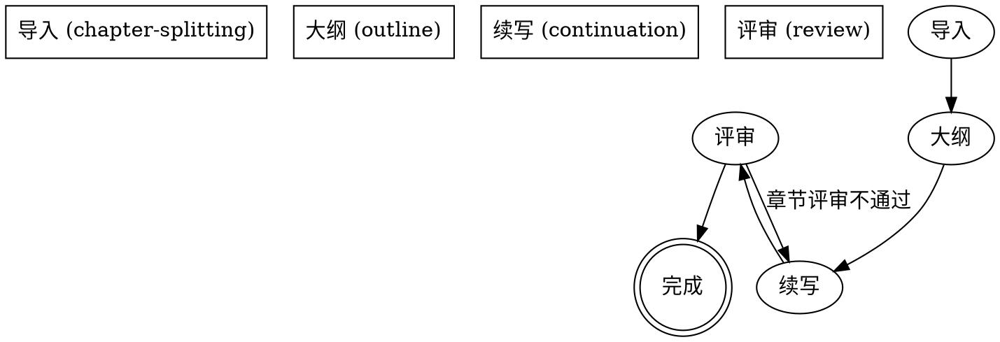

# novel-continuation 模块化重构实施计划

> **For agentic workers:** REQUIRED SUB-SKILL: Use superpowers:subagent-driven-development (recommended) or superpowers:executing-plans to implement this plan task-by-task. Steps use checkbox (`- [ ]`) syntax for tracking.

**Goal:** 将单体 `novel-continuation/SKILL.md`（1430 行）拆分为 4 个独立技能 + 1 个轻量总入口，使每个技能可独立触发、独立测试、独立维护。

**Architecture:** 保留原 `novel-continuation/SKILL.md` 作为轻量导航入口；新增 4 个子目录承载独立技能。子技能通过 `meta/_project-meta.json.currentStep` 和关键文件存在性实现两层中断恢复。

**Tech Stack:** Markdown（技能文档）、JSON（项目元数据）、dot graphviz（流程图，可选）

**Plan 策略说明：** 本任务为"文档内容迁移"而非"代码编写"。Task 2-5 中的"复制原 SKILL.md 第 X-Y 行"是显式取用指令——工程师在执行时读取 `novel-continuation/SKILL.md.bak` 的对应行号范围，复制到目标文件。每个 Task 给出了目标文件的 frontmatter + 章节结构 + 关键样板，使工程师无需来回切换即可完成迁移。原 SKILL.md 已备份（Task 1 Step 1），行号映射在 `docs/superpowers/specs/2026-06-02-novel-continuation-modularization-design.md` 第 8 节。

---

## File Structure

```
novel-continuation/
  SKILL.md                        # 改写为轻量入口（~200 行）
  chapter-splitting/
    SKILL.md                      # 新建（~350 行）
  outline/
    SKILL.md                      # 新建（~500 行）
  continuation/
    SKILL.md                      # 新建（~250 行）
  review/
    SKILL.md                      # 新建（~350 行）
```

文件职责：
- `novel-continuation/SKILL.md`：总流程图、4 个子技能导航、项目目录结构、状态契约、关键原则、通用红旗
- `chapter-splitting/SKILL.md`：第 0 步 0-A 导入、0-B 未完成项目检测、恢复点探测
- `outline/SKILL.md`：第 1-3 步分析/询问/大纲、第 3-A 步强化约束、文风模仿
- `continuation/SKILL.md`：第 4 步逐章写作（不含评审门）
- `review/SKILL.md`：第 5 步质量循环、章节评审门、33 维度、整体架构评估

---

## Task 1: 备份原 SKILL.md + 创建目录骨架

**Files:**
- Create: `novel-continuation/chapter-splitting/` (目录)
- Create: `novel-continuation/outline/` (目录)
- Create: `novel-continuation/continuation/` (目录)
- Create: `novel-continuation/review/` (目录)
- Create: `novel-continuation/SKILL.md.bak` (备份)

- [ ] **Step 1: 备份原 SKILL.md**

```bash
Copy-Item -LiteralPath "novel-continuation/SKILL.md" -Destination "novel-continuation/SKILL.md.bak"
```

- [ ] **Step 2: 验证备份成功**

```bash
Test-Path -LiteralPath "novel-continuation/SKILL.md.bak"
Get-ChildItem -LiteralPath "novel-continuation/SKILL.md.bak" | Select-Object Length
```

Expected: `True`，文件大小与原 SKILL.md 一致

- [ ] **Step 3: 创建 4 个子目录**

```bash
New-Item -ItemType Directory -Path "novel-continuation/chapter-splitting" -Force
New-Item -ItemType Directory -Path "novel-continuation/outline" -Force
New-Item -ItemType Directory -Path "novel-continuation/continuation" -Force
New-Item -ItemType Directory -Path "novel-continuation/review" -Force
```

- [ ] **Step 4: 验证目录结构**

```bash
Get-ChildItem -LiteralPath "novel-continuation" -Directory | Select-Object Name
```

Expected: 输出包含 `chapter-splitting`、`outline`、`continuation`、`review` 4 个目录

- [ ] **Step 5: 提交**

```bash
git add novel-continuation/
git commit -m "refactor: backup original SKILL.md and create 4 sub-skill directories"
```

---

## Task 2: 创建 chapter-splitting/SKILL.md（阶段 1：导入 + 三遍读取 + 约束文档）

**Files:**
- Create: `novel-continuation/chapter-splitting/SKILL.md`

- [ ] **Step 1: 创建文件并写入 frontmatter + 概述**

写入 `novel-continuation/chapter-splitting/SKILL.md`：

```markdown
---
name: chapter-splitting
description: >
  Use when the user provides an existing novel file or text for
  continuation, or when resuming an unfinished project in
  novel-projects/. Triggers on: existing text, "import this novel",
  "continue from here", resumption after interruption.
---

# 章节拆分技能（第 0 步）

## 概述

负责现有小说的导入与三遍读取分析。文件分割 → 三遍读取法 → 隐式推断 → 约束文档生成 → 质量自检 → 拆分校验 → 确认门。支持未完成项目的检测与恢复。

## 何时使用

- 用户说"导入这部小说"、"续写这部小说"
- 用户提供现有小说文件/文本
- `novel-projects/` 中有未完成的 `meta/_project-meta.json` 项目需要恢复
- 用户说"从中断的地方继续"

**不要用于：**
- 编辑现有文本
- 从零开始创作新故事（应使用 outline 技能的前置分析）
- 已完成拆分，仅需分析或续写（应使用 outline / continuation 技能）

## 核心工作流

[完整流程图：从原 SKILL.md 第 30-67 行复制]

## 写前确认（进入 0-A 前必须执行）

[从原 SKILL.md 第 123-130 行复制]

## 第 0 步 0-A：导入现有小说

[从原 SKILL.md 第 133-366 行完整复制]

**新增字段：** 在 0-A 步骤7（更新项目元数据）中，`meta/_project-meta.json` 增加 `importStage` 字段。字段值为当前进度：`"step1" | "step2" | "step3" | "step4" | "step5" | "step6" | "done"`。每完成一步立即更新。完成时设为 `"done"`。

## 恢复点表

[从 `docs/superpowers/specs/2026-06-02-novel-continuation-modularization-design.md` 第 6.2 节 "chapter-splitting 恢复点表" 复制]

## 第 0 步 0-B：未完成项目检测

[从原 SKILL.md 第 382-422 行完整复制，并补充：检测时优先读 `importStage` 字段，若存在则比 0-B 原表更精确的恢复]

## ✅ 完成确认门

[从原 SKILL.md 第 333-365 行复制输出模板]

## 红旗

[从原 SKILL.md 第 1376-1383 行复制第 0 步相关红旗]
```

- [ ] **Step 2: 验证文件创建**

```bash
Test-Path -LiteralPath "novel-continuation/chapter-splitting/SKILL.md"
Get-ChildItem -LiteralPath "novel-continuation/chapter-splitting/SKILL.md" | Select-Object Length
```

Expected: `True`，文件大小 > 30KB

- [ ] **Step 3: 验证关键章节存在**

```bash
Select-String -Path "novel-continuation/chapter-splitting/SKILL.md" -Pattern "^## 第 0 步 0-A|^## 第 0 步 0-B|chapter-splitting" | Select-Object LineNumber
```

Expected: 至少 3 个匹配（含 frontmatter 中的 name）

- [ ] **Step 4: 提交**

```bash
git add novel-continuation/chapter-splitting/SKILL.md
git commit -m "feat: add chapter-splitting skill (stage 1: import + analysis)"
```

---

## Task 3: 创建 outline/SKILL.md（阶段 2：分析 + 大纲 + 强化约束）

**Files:**
- Create: `novel-continuation/outline/SKILL.md`

- [ ] **Step 1: 创建文件并写入 frontmatter + 概述**

写入 `novel-continuation/outline/SKILL.md`：

```markdown
---
name: outline
description: >
  Use after chapter-splitting when chapter files exist and the user
  needs to analyze the novel, generate a continuation outline, and
  strengthen constraint documents. Triggers on: "write the outline",
  "plan the continuation", "analyze and plan".
---

# 大纲生成技能（第 1-3-A 步）

## 概述

负责分析已拆分的小说文本、给出续写建议、生成大纲、强化约束文档。是 chapter-splitting 与 continuation 之间的桥梁。

## 何时使用

- 章节文件已拆分（`chapters/*.md` 存在）
- 用户说"分析小说"、"生成大纲"、"规划续写"
- `meta/_project-meta.json.currentStep == "import-done"` 之后

**不要用于：**
- 文件未拆分（应先调用 chapter-splitting）
- 大纲已生成，需要开始写作（应使用 continuation 技能）

## 核心工作流

[流程图：分析 → 询问 → 生成大纲 → 强化约束]

## 写前确认

- [ ] `chapters/*.md` 存在
- [ ] `meta/_project-meta.json.currentStep` ∈ {`import-done`, `answers-ready`, `outline-ready`}
- [ ] 5 个 `design/*.md` 或仅部分存在（视当前进度）

## 恢复点表

[从 `docs/superpowers/specs/2026-06-02-novel-continuation-modularization-design.md` 第 6.2 节 "outline 恢复点表" 复制]

## 第 1 步：分析文本

[从原 SKILL.md 第 426-512 行完整复制]

## 第 2 步：建议 + 询问 2 个问题

[从原 SKILL.md 第 516-605 行完整复制]

## ⛔ 创建项目文件

[从原 SKILL.md 第 564-605 行复制]

## 第 3 步：生成大纲

[从原 SKILL.md 第 609-642 行完整复制]

## 第 3-A 步：强化约束文档

[从原 SKILL.md 第 646-825 行完整复制]

## 高级功能：文风模仿

[从原 SKILL.md 第 1214-1265 行完整复制]

## 红旗

[从原 SKILL.md 第 1390-1408 行复制大纲阶段相关红旗]
```

- [ ] **Step 2: 验证文件创建**

```bash
Test-Path -LiteralPath "novel-continuation/outline/SKILL.md"
Get-ChildItem -LiteralPath "novel-continuation/outline/SKILL.md" | Select-Object Length
```

Expected: `True`，文件大小 > 40KB

- [ ] **Step 3: 验证关键章节存在**

```bash
Select-String -Path "novel-continuation/outline/SKILL.md" -Pattern "^## 第 [123]|^## 恢复点|outline" | Select-Object LineNumber
```

Expected: 至少 5 个匹配

- [ ] **Step 4: 提交**

```bash
git add novel-continuation/outline/SKILL.md
git commit -m "feat: add outline skill (stage 2: analysis + outline + constraints)"
```

---

## Task 4: 创建 continuation/SKILL.md（阶段 3：逐章写作，不含评审）

**Files:**
- Create: `novel-continuation/continuation/SKILL.md`

- [ ] **Step 1: 创建文件并写入 frontmatter + 概述**

写入 `novel-continuation/continuation/SKILL.md`：

```markdown
---
name: continuation
description: >
  Use after outline is approved when chapters need to be written
  serially. Triggers on: "start writing", "write chapter N",
  "continue the story", or when the project state currentStep is
  "writing".
---

# 续写技能（第 4 步）

## 概述

负责大纲批准后的逐章写作。串行模式，无中断写作区段，每章完成后调用 review 技能评审。

**注意：** 本技能不包含章节评审门和 33 维度审计——这些由 review 技能负责。

## 何时使用

- 大纲已批准（`design/01-大纲.md` 存在且 `meta/02-写作计划.json.chapters` 非空）
- `meta/_project-meta.json.currentStep == "writing"`
- 用户说"开始写"、"写下一章"、"继续创作"

**不要用于：**
- 大纲未生成
- 章节评审（应使用 review 技能）
- 全局质量循环（应使用 review 技能）

## 核心工作流

[流程图：写前分析 → 撰写 → 撰写后优化 → 收尾 → 自动流转 → 调用 review]

## 写前确认

- [ ] `meta/_project-meta.json.currentStep == "writing"` 或上一章已完成
- [ ] 5 个 `design/*.md` 已生成
- [ ] 7 个 `truth/*.json` 已生成
- [ ] `meta/02-写作计划.json.chapters` 至少有一个 `status != "completed"`

## 恢复点表

[从 `docs/superpowers/specs/2026-06-02-novel-continuation-modularization-design.md` 第 6.2 节 "continuation 恢复点表" 完整复制，含流程图与大纲覆盖度 70% 阈值定义]

## 无中断写作区段

[从原 SKILL.md 第 848-881 行完整复制]

## 逐章创作流程

[从原 SKILL.md 第 883-1038 行完整复制，但剔除 974-1012 章节评审门]

## 自动流转（每章最后一步）

[从原 SKILL.md 第 1039-1063 行完整复制]

## 红旗

[从原 SKILL.md 第 1390-1408 行复制续写阶段相关红旗]
```

- [ ] **Step 2: 验证文件创建**

```bash
Test-Path -LiteralPath "novel-continuation/continuation/SKILL.md"
Get-ChildItem -LiteralPath "novel-continuation/continuation/SKILL.md" | Select-Object Length
```

Expected: `True`，文件大小 > 20KB

- [ ] **Step 3: 验证关键章节存在**

```bash
Select-String -Path "novel-continuation/continuation/SKILL.md" -Pattern "^## 逐章创作|^## 自动流转|continuation" | Select-Object LineNumber
```

Expected: 至少 3 个匹配

- [ ] **Step 4: 验证评审门不包含**

```bash
Select-String -Path "novel-continuation/continuation/SKILL.md" -Pattern "章节评审门|33 维度" | Select-Object LineNumber
```

Expected: 0 个匹配（评审相关内容已剔除）

- [ ] **Step 5: 提交**

```bash
git add novel-continuation/continuation/SKILL.md
git commit -m "feat: add continuation skill (stage 3: serial writing, no review)"
```

---

## Task 5: 创建 review/SKILL.md（阶段 4：评审 + 33 维度 + 质量循环）

**Files:**
- Create: `novel-continuation/review/SKILL.md`

- [ ] **Step 1: 创建文件并写入 frontmatter + 概述**

写入 `novel-continuation/review/SKILL.md`：

```markdown
---
name: review
description: >
  Use after a chapter is written to run the chapter review gate
  (5-item checklist: character consistency, worldview, context
  alignment, hook quality, quality baseline), or when all chapters
  are complete to run the 33-dimension global audit, auto-revision
  (max 3 rounds), and overall architecture assessment.
---

# 评审技能（第 5 步）

## 概述

负责所有质量评审工作。两种模式：
1. **章节评审门** - 每章完成后的 5 项检查
2. **全局质量循环** - 全部章节完成后的 33 维度审计

## 何时使用

- 章节完成后自动调用（由 continuation 技能的自动流转触发）
- 用户说"评审"、"审计"、"质量检查"
- `meta/_project-meta.json.currentStep` ∈ {`writing`, `quality-loop`}

**不要用于：**
- 写作（应使用 continuation 技能）
- 分析或大纲（应使用 outline 技能）

## 核心工作流

[流程图：章节评审门 → 33 维审计 → 修订循环 → 整体架构评估 → 完成报告]

## 写前确认

- [ ] 至少一个 `chapters/第XX章-*.md` 已存在
- [ ] 章节字数 ≥ 2500（章节门）或全部章节 status=completed（质量循环）

## 恢复点表

[从 `docs/superpowers/specs/2026-06-02-novel-continuation-modularization-design.md` 第 6.2 节 "review 恢复点表" 完整复制]

## 章节评审门（5 项检查）

[从原 SKILL.md 第 974-1012 行完整复制]

## 33 维度质量审计

[从原 SKILL.md 第 1269-1367 行完整复制]

## 质量循环（自动修订 3 轮）

[从原 SKILL.md 第 1112-1127 行完整复制]

## 整体架构评估

[从原 SKILL.md 第 1129-1143 行完整复制]

## 完成报告

[从原 SKILL.md 第 1145-1173 行完整复制]

## 约束文档体系参考

[从原 SKILL.md 第 1183-1210 行完整复制]

## 红旗

[从原 SKILL.md 第 1390-1408 行复制评审阶段相关红旗]
```

- [ ] **Step 2: 验证文件创建**

```bash
Test-Path -LiteralPath "novel-continuation/review/SKILL.md"
Get-ChildItem -LiteralPath "novel-continuation/review/SKILL.md" | Select-Object Length
```

Expected: `True`，文件大小 > 30KB

- [ ] **Step 3: 验证关键章节存在**

```bash
Select-String -Path "novel-continuation/review/SKILL.md" -Pattern "^## 章节评审门|^## 33 维度|^## 质量循环|review" | Select-Object LineNumber
```

Expected: 至少 4 个匹配

- [ ] **Step 4: 提交**

```bash
git add novel-continuation/review/SKILL.md
git commit -m "feat: add review skill (stage 4: chapter gate + 33-dim audit + quality loop)"
```

---

## Task 6: 重写 novel-continuation/SKILL.md（轻量入口）

**Files:**
- Modify: `novel-continuation/SKILL.md` (从 1430 行重写为 ~200 行)

- [ ] **Step 1: 写入新的轻量入口**

完全覆盖 `novel-continuation/SKILL.md`：

```markdown
---
name: novel-continuation
description: >
  Use when the user wants to continue, expand, or import an existing
  novel. Entry skill that routes to one of four sub-skills:
  chapter-splitting (stage 1: import), outline (stage 2: analysis +
  outline), continuation (stage 3: serial writing), review (stage 4:
  quality audit). For resumption, reads meta/_project-meta.json to
  detect the current state and route to the appropriate sub-skill.
---

# 小说续写技能族

包含 4 阶段：导入 → 大纲 → 续写 → 评审。每个阶段一个独立子技能，按需触发。

## 何时使用

- 用户说"续写"、"继续写"、"导入小说" → 引导到 chapter-splitting
- `novel-projects/` 中已有 `meta/_project-meta.json` → 读取 currentStep 路由到对应子技能
- 任意阶段需要恢复 → 路由到对应子技能（子技能自身做恢复点探测）

## 核心工作流（总览）



## 4 个子技能

| 阶段 | 技能 | 何时调用 |
|------|------|---------|
| 1 | `chapter-splitting` | 提供小说文件 / 恢复未完成项目 |
| 2 | `outline` | 已拆分，需要分析+大纲 |
| 3 | `continuation` | 大纲已批准，开始写作 |
| 4 | `review` | 章节评审 / 全局质量循环 |

## 项目目录结构

```
novel-projects/
  [项目名称]/
    meta/
      _project-meta.json
      02-写作计划.json
    design/
      00-人物档案.md
      01-大纲.md
      03-世界设定书.md
      04-时间线.md
      05-术语表.md
      06-核心驱动.md
      98-写作决策日志.md
      99-冲突日志.md
      style-guide.md
    chapters/
      第XX章-标题.md
      _markers.md
      _review-第XX章.md
    truth/
      world-state.json
      character-matrix.json
      resource-ledger.json
      chapter-summaries.json
      subplot-board.json
      emotional-arcs.json
      pending-hooks.json
```

## 状态契约

| currentStep | 含义 | 下一阶段 |
|------------|------|---------|
| (无) | 未开始 | chapter-splitting |
| import-done | 导入完成 | outline |
| answers-ready | 已回答 2 个问题 | outline |
| outline-ready | 大纲已生成 | outline |
| constraint-docs | 约束文档已强化 | continuation |
| writing | 写作中 | continuation / review |
| quality-loop | 质量循环中 | review |
| report-ready | 完成报告 | [终态] |

## 关键原则

1. **chapter-splitting 是强制入口** - 只要用户提供文件，必须先执行 0-A 导入流程
2. **逐章写作禁止提问** - 一旦开始第 4 步，必须连续完成所有章节
3. **只使用串行模式** - 不使用并行或 Teams 模式
4. **质量循环自动修订** - 写作完成后自动审计修订，不询问用户
5. **约束文档体系** - 12 个约束文档（5 design/*.md + 7 truth/*.json）保证一致性

## 通用红旗

- 跳过 chapter-splitting → 禁止
- 在续写中向用户提问 → 禁止
- 完成一章后停止等指令 → 禁止
- 跳过质量循环 → 禁止
- 修改约束文档后未更新真相文件 → 禁止

## 子技能详细文档

- `chapter-splitting/SKILL.md` - 阶段 1 完整流程
- `outline/SKILL.md` - 阶段 2 完整流程
- `continuation/SKILL.md` - 阶段 3 完整流程
- `review/SKILL.md` - 阶段 4 完整流程
```

- [ ] **Step 2: 验证文件已重写**

```bash
Get-ChildItem -LiteralPath "novel-continuation/SKILL.md" | Select-Object Length
```

Expected: 文件大小在 5-10KB（约 200 行）

- [ ] **Step 3: 验证 frontmatter 正确**

```bash
Select-String -Path "novel-continuation/SKILL.md" -Pattern "^name:|^description:" | Select-Object LineNumber
```

Expected: 2 个匹配（name + description 在 frontmatter 中）

- [ ] **Step 4: 验证子技能引用存在**

```bash
Select-String -Path "novel-continuation/SKILL.md" -Pattern "chapter-splitting|SKILL\.md" | Select-Object LineNumber
```

Expected: 至少 4 个匹配（指向 4 个子技能）

- [ ] **Step 5: 提交**

```bash
git add novel-continuation/SKILL.md
git commit -m "refactor: rewrite novel-continuation/SKILL.md as lightweight entry (router)"
```

---

## Task 7: 内容完整性验证

**Files:**
- Verify only (no file changes)

- [ ] **Step 1: 备份文件存在性检查**

```bash
Test-Path -LiteralPath "novel-continuation/SKILL.md.bak"
```

Expected: `True`

- [ ] **Step 2: 5 个 SKILL.md 文件存在**

```bash
Get-ChildItem -LiteralPath "novel-continuation" -Recurse -Filter "SKILL.md" | Select-Object FullName, Length
```

Expected: 5 个文件（novel-continuation/SKILL.md + 4 个子技能 SKILL.md）

- [ ] **Step 3: 提取并对比内容行数**

```bash
$original = (Get-Content -LiteralPath "novel-continuation/SKILL.md.bak" -Raw) -split "`n"
$subtotal = 0
foreach ($file in @("chapter-splitting", "outline", "continuation", "review")) {
    $path = "novel-continuation/$file/SKILL.md"
    $content = Get-Content -LiteralPath $path -Raw
    $lines = ($content -split "`n").Count
    $subtotal += $lines
    Write-Host "$file : $lines lines"
}
$entry = ((Get-Content -LiteralPath "novel-continuation/SKILL.md" -Raw) -split "`n").Count
$subtotal += $entry
Write-Host "entry : $entry lines"
Write-Host "total (excluding bak): $subtotal lines"
Write-Host "original: $($original.Count) lines"
```

Expected: 4 个子技能 + 入口的总行数 ≥ 原 SKILL.md 行数（允许少量去重，但不应大量丢失）

- [ ] **Step 4: 关键术语存在于原位置的检查**

对每个原 SKILL.md 中的关键章节标题，确认至少一个子技能文件包含该内容：

```bash
$keyTerms = @(
    "三遍读取法",
    "隐式设定推断",
    "0-A 步骤1",
    "章节评审门",
    "33 维度",
    "质量循环",
    "逐章创作流程",
    "自动流转",
    "整体架构评估"
)
foreach ($term in $keyTerms) {
    $found = Select-String -Path "novel-continuation" -Recurse -Pattern $term -ErrorAction SilentlyContinue
    if ($found) {
        Write-Host "✓ $term - found in $($found.Path)"
    } else {
        Write-Host "✗ $term - NOT FOUND"
    }
}
```

Expected: 所有 9 个关键术语都至少被找到一次

- [ ] **Step 5: 验证评审门不在 continuation**

```bash
Select-String -Path "novel-continuation/continuation/SKILL.md" -Pattern "5-item checklist|33-dimension"
```

Expected: 无匹配（评审内容已剥离到 review 技能）

- [ ] **Step 6: 提交验证记录**

```bash
git status  # 确认无未提交的修改
```

如果验证失败，根据 Step 4 输出回到对应 Task 修复。

---

## Task 8: 最终提交与清理

**Files:**
- Delete: `novel-continuation/SKILL.md.bak` (验证通过后)

- [ ] **Step 1: 确认所有修改已提交**

```bash
git status
```

Expected: 无未提交的修改（或者只有 .bak 文件）

- [ ] **Step 2: 查看提交历史**

```bash
git log --oneline -10
```

Expected: 至少 6 个新提交（Task 1-6 各 1 个）

- [ ] **Step 3: 删除备份文件（验证通过后）**

```bash
Remove-Item -LiteralPath "novel-continuation/SKILL.md.bak"
```

- [ ] **Step 4: 最终提交**

```bash
git add -A
git commit -m "chore: remove original SKILL.md backup after successful modularization"
```

- [ ] **Step 5: 最终目录结构展示**

```bash
Get-ChildItem -LiteralPath "novel-continuation" -Recurse | Select-Object FullName
```

Expected: 5 个 SKILL.md + 4 个子目录，无 .bak 文件

---

## Self-Review Checklist

执行每个任务后请确认：

- [ ] **Task 1**: 目录骨架创建成功，原 SKILL.md 已备份
- [ ] **Task 2**: chapter-splitting/SKILL.md 包含原 133-422 行内容
- [ ] **Task 3**: outline/SKILL.md 包含原 426-825 + 1214-1265 行内容
- [ ] **Task 4**: continuation/SKILL.md 包含原 829-1063（剔除 974-1012）行内容
- [ ] **Task 5**: review/SKILL.md 包含原 974-1012 + 1067-1173 + 1183-1210 + 1269-1367 行内容
- [ ] **Task 6**: novel-continuation/SKILL.md 重写为 ~200 行轻量入口
- [ ] **Task 7**: 内容完整性验证通过（9 个关键术语全部找到）
- [ ] **Task 8**: 备份已删除，所有修改已提交

## 风险与回退

如果任何 Task 失败：
1. 停止后续 Task
2. 检查 `git log` 找到上一个正常提交的 commit
3. `git reset --hard <commit>` 回退
4. 重新分析失败原因，修复后从失败 Task 重新开始
