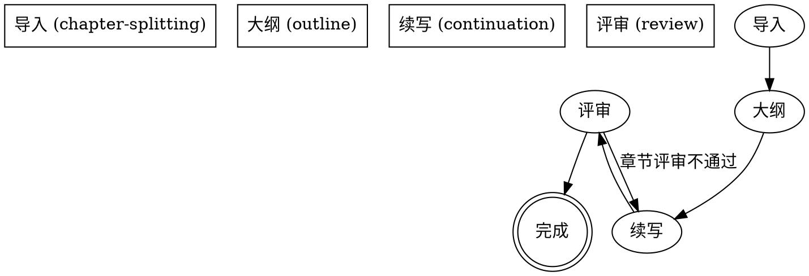

---
name: novel-continuation
description: >
  Use when the user wants to continue, expand, or import an existing
  novel. Entry skill that routes to one of four sub-skills:
  chapter-splitting (stage 0: import), outline (stage 1-3: analysis +
  outline), continuation (stage 4: serial writing), review (stage 5:
  quality audit). For resumption, reads meta/_project-meta.json to
  detect the current state and route to the appropriate sub-skill.
---

# 小说续写技能族

包含 4 阶段：导入 → 大纲 → 续写 → 评审。每个阶段一个独立子技能，按需触发。

## 何时使用

- 用户说"续写"、"继续写"、"导入小说" → 引导到 chapter-splitting
- `novel-projects/` 中已有 `meta/_project-meta.json` → 读取 currentStep 路由到对应子技能
- 任意阶段需要恢复 → 路由到对应子技能（子技能自身做恢复点探测）

## 核心工作流（总览）



## 4 个子技能

| 阶段 | 技能 | 何时调用 |
|------|------|---------|
| 0 | `chapter-splitting` | 提供小说文件 / 恢复未完成项目 |
| 1-3 | `outline` | 已拆分，需要分析+大纲 |
| 4 | `continuation` | 大纲已批准，开始写作 |
| 5 | `review` | 章节评审 / 全局质量循环 |

## 全局交互点清单（硬约束）

**整个工作流中，允许与用户对话的固定节点只有以下 4 个**。其他位置一律禁止 AskUserQuestion / 停下来等待：

| # | 阶段 | 交互内容 | 出处 |
|---|------|---------|------|
| 1 | chapter-splitting 0-B | 询问"继续上次创作？" | 恢复未完成项目时 |
| 2 | outline 第 2 步 | 询问 2 个问题（章节数、是否增加人物） | 生成大纲前 |
| 3 | outline 第 3 步 | 询问大纲批准 | 大纲写入后 |
| 4 | review 完成报告 | 一次性汇报全部结果 | 全局审计完成后 |

**违反此清单的 AskUserQuestion = 红旗，必须拒绝并写入决策日志。**

## 状态字段命名规范

整个工作流使用 3 层状态字段，**层级与命名严格分离**：

| 层级 | 字段路径 | 取值空间 | 用途 |
|------|---------|---------|------|
| 项目阶段 | `meta/_project-meta.json.currentStep` | `import-done` / `answers-ready` / `outline-ready` / `constraint-docs` / `writing` / `writing-paused` / `quality-loop` / `report-ready` | 路由用，**决定跳到哪个子技能** |
| 项目状态 | `meta/02-写作计划.json.status` | `pending` / `in_progress` / `paused` / `auditing` / `completed` / `failed` | 项目整体状态（章节列表之上） |
| 章节状态 | `meta/02-写作计划.json.chapters[i].status` | `pending` / `in_progress` / `completed` / `failed` | 单章状态 |

**关键约定：**
- `currentStep` 决定"下一步做什么"；`status` 决定"现在能不能做"
- 章节级 `status` **不得使用 `paused`**，暂停是项目级概念
- 校对场景（工程已存在）时，所有已有章节标记为 **`pending`** 而非 `completed`——`completed` 只用于"本章已通过评审"（参考 review 技能定义）
- 进入写作时（currentStep = "writing"），项目 `status` 必须为 `in_progress`
- 进入质量循环时（currentStep = "quality-loop"），项目 `status` 必须为 `auditing`
- 全部章节评审通过后，项目 `status` 才能设为 `completed`

## 状态契约

| currentStep | 含义 | 下一阶段 |
|------------|------|---------|
| (无) | 未开始 | chapter-splitting |
| import-done | 导入完成 | outline |
| answers-ready | 已回答 2 个问题 | outline |
| outline-ready | 大纲已生成 | outline |
| constraint-docs | 约束文档已强化 | continuation |
| writing | 写作中 | continuation / review |
| writing-paused | 写作被用户暂停 | continuation（恢复） |
| quality-loop | 质量循环中 | review |
| report-ready | 完成报告 | [终态] |

## 约束文档分类

12 个约束文档按**必要性**分 3 类：

### 必选（任何题材都生成）
**5 design/*.md：**
- `00-人物档案.md` — 完整人物档案
- `01-大纲.md` — 章节规划
- `03-世界设定书.md` — 世界观规则
- `04-时间线.md` — 事件时间线
- `05-术语表.md` — 专有名词
- `06-核心驱动.md` — 主线/支线/伏笔追踪（注意：原编号 06 不变）

**7 truth/*.json：**
- `world-state.json` — 世界状态
- `character-matrix.json` — 角色关系矩阵
- `resource-ledger.json` — 资源账本
- `chapter-summaries.json` — 章节摘要
- `subplot-board.json` — 支线进度板
- `emotional-arcs.json` — 情感弧线
- `pending-hooks.json` — 待处理钩子

### 按题材激活
- `design/02-风格指南.md`（仅当用户提供参考文风时）
- `truth/数值系统.json`（仅玄幻/仙侠/LitRPG/系统末日）
- `truth/年代考据.json`（仅都市/历史题材）

### 运行时追加
- `design/98-写作决策日志.md` — 写作中不确定的决策记录（中断/不确定时追加）
- `design/99-冲突日志.md` — 跨章设定矛盾记录（逆向工程 + 续写中更新）
- `meta/_run-log.jsonl` — 每步执行的运行轨迹（自动追加）

### 游戏衍生（游戏小说续写时追加）
- `design/游戏大纲.md` — 游戏主线/支线/剧情节点概要
- `design/游戏基本情况.md` — 游戏类型/世界观/角色设定/核心机制

## 项目目录结构

```
novel-projects/
  [项目名称]/
    meta/
      _project-meta.json
      02-写作计划.json
      _run-log.jsonl
     design/
       00-人物档案.md
       01-大纲.md (master 大纲索引)
       02-风格指南.md (按题材)
       03-世界设定书.md
       04-时间线.md
       05-术语表.md
       06-核心驱动.md
       98-写作决策日志.md
       99-冲突日志.md
       游戏大纲.md (游戏衍生)
       游戏基本情况.md (游戏衍生)
    outline/                        ← 按章节拆分的大纲
      第XX章-大纲.md
    chapters/
      第XX章-标题.md
      _markers.md
    review/                         ← 章节评审门（5项）
      _review-第XX章.md
    audit/                          ← 33维质量审计
      _audit-第XX章.md
    truth/
      world-state.json
      character-matrix.json
      resource-ledger.json
      chapter-summaries.json
      subplot-board.json
      emotional-arcs.json
      pending-hooks.json
```

## 可调参数（嵌入 _project-meta.json.config）

```json
{
  "config": {
    "minWordCount": 3000,
    "reviewPassThreshold": 2500,
    "outlineCoverageThreshold": 0.7,
    "maxRevisionRounds": 3,
    "maxTotalRevisionPerChapter": 5,
    "blockSize": 10,
    "genre": "xianxia",
    "tokenBudget": {
      "contextWindow": 200000,
      "switchToSummaryOnly": 0.6,
      "forceSummarize": 0.85
    }
  }
}
```

**默认值见上表。** 单项目可覆盖。题材识别见 review 技能。

## 全局恢复决策树

进入任意子技能时，**先读 `meta/_project-meta.json.currentStep`**，再按以下决策树跳转：

```
读 currentStep
├─ 空 / 不存在              → chapter-splitting 0-A
├─ import-done              → outline 第 1 步
├─ answers-ready            → outline 第 3 步（答案在 answers 字段）
├─ outline-ready            → outline 第 3-A 步
├─ constraint-docs          → continuation 写前确认
├─ writing                  → continuation（找 chapters 数组中第一个非 completed）
├─ writing-paused           → continuation（恢复，更新状态为 writing）
├─ quality-loop             → review（找 review/_review-第N章.md 缺失或 status != "passed"）
└─ report-ready             → review 完成报告
```

**子技能内部恢复表仅用于本阶段内部的精细恢复**（如 0-A 步骤1-7 内部进度），不与本决策树冲突。

## 通用红旗（适用于所有子技能）

子技能红旗只列**本阶段特有**的规则。下列通用红旗在所有阶段生效：

| 红旗 | 正确做法 |
|------|---------|
| 询问超出"全局交互点清单"的问题 | 写入决策日志，按默认继续 |
| 完成一章后停下来等指令 | 自动流转到下一章 |
| 在续写中输出章节进度 | 仅在完成报告时汇报 |
| 跳过 0-A 导入直接开始分析 | 0-A 是硬性入口，不可跳过 |
| 修改约束文档后未更新真相文件 | 双轨必须同步 |
| 跳过质量循环 | 必须完成全部章节审计 |
| 使用并行/teams 模式 | 只允许串行 |
| 章节文件使用非 UTF-8 编码 | 统一 UTF-8 |
| 题材与激活维度不一致 | 维度激活以 `config.genre` 为准，不靠 AI 主观判断 |
| 修订轮次超过 `config.maxTotalRevisionPerChapter` | 标记 `failed`，继续下一章 |
| 写入新内容前未读最新真相文件 | 必须先读再写 |

## 关键原则

1. **chapter-splitting 是强制入口** - 只要用户提供文件，必须先执行 0-A 导入流程
2. **逐章写作禁止提问** - 一旦开始第 4 步，必须连续完成所有章节
3. **只使用串行模式** - 不使用并行或 Teams 模式
4. **质量循环自动修订** - 写作完成后自动审计修订，不询问用户
5. **约束文档双轨** - 5 design + 7 truth 必选；按题材/运行时分类按需
6. **维度激活机械化** - 33 维激活由 `config.genre` 决定，不由 AI 主观判断

## 子技能详细文档

- `chapter-splitting/SKILL.md` - 阶段 0 完整流程
- `outline/SKILL.md` - 阶段 1-3 完整流程
- `continuation/SKILL.md` - 阶段 4 完整流程
- `review/SKILL.md` - 阶段 5 完整流程

## 异常决策树附录

| 异常 | 决策 |
|------|------|
| AI 输出超过 8000 字 | 按场景切分为多章，文件名 `第N+1章-标题.md`，同步追加到 02-写作计划.json |
| 约束文档全部损坏 | 回到 chapter-splitting 0-A 步骤4 重建 |
| 02-写作计划.json JSON 不合法 | 解析失败则备份为 `02-写作计划.json.bak`，根据 `currentStep` 重建骨架 |
| 题材识别失败 | 默认 `genre: "general"`，仅激活基础 8 维 + 全部题材通用维度 |
| AI 误输出用户对话请求 | 立即停止，98 决策日志追加一行，继续当前步骤 |
| 大纲严重缺失导致无法续写 | 标记当前章节 `status: "failed"`，继续下一章，完成报告时统一说明 |
| 文件名包含特殊字符 | URL 编码后存储，原名写入章节的 `title` 字段 |
