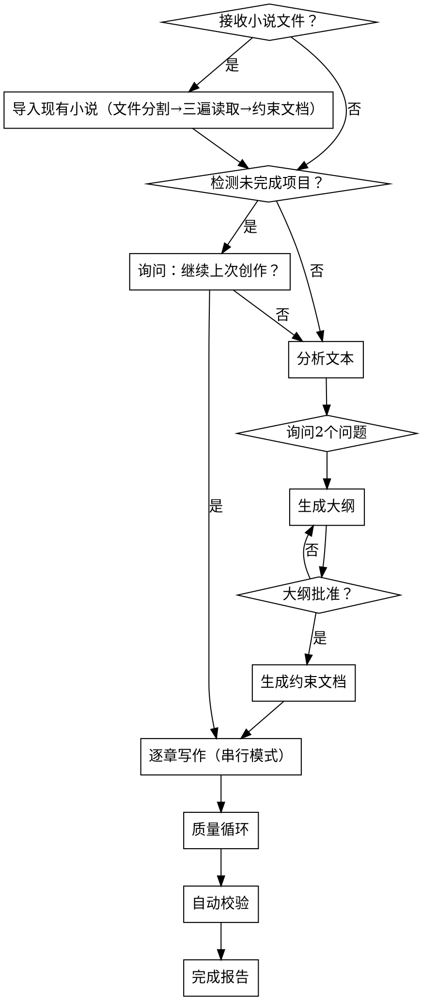

---
name: novel-continuation
description: >
  当用户要求续写小说、扩展故事或需要根据现有文本生成新章节时使用。
  支持分析现有文本、生成大纲、获取批准后完整续写、中断续写检测、
  导入现有小说、文风模仿、33维度质量审计、真相文件机制。
---

# 小说续写技能

## 概述

引导用户完成小说续写：**🔴 [强制：第0步] 导入现有小说（文件分割→三遍读取→生成约束文档）** → 检测未完成作品 → 分析文本 → **给出建议续写章节数 → 询问2个问题** → 生成大纲 → 获取批准 → 生成约束文档 → **逐章写作（串行模式），过程中禁止提问**。支持导入续写、文风模仿、33维度质量审计、约束文档体系一致性保证。

> ⚠️ **🔴 第0步是强制入口步骤。只要用户提供了任何文件，第0步就是唯一合法的起点。不存在"先跳过第0步后面再补"的选项。**

## 何时使用

- 用户说"续写"、"continue writing"、"expand story"
- 用户提供现有小说文本
- 用户想要扩展小说
- 检测未完成的小说项目（中断续写）
- 需要导入现有小说文件并续写
- 需要模仿特定作者文风

**不要用于：** 编辑现有文本、从零开始创作新故事。

## 核心工作流程



> 🖼️ **流程图强制检查：执行每一步之前，必须先对照上方的流程图，确认当前所处的节点。只有确认后，才能进入该步骤。**

## 关键原则

1. **🔴 导入是强制前置步骤（第0步·0-A）** - 只要用户提供文件/文本，必须先执行 0-A 导入流程（文件分割→三遍读取→约束文档生成），然后才能分析或续写。**不可跳过，不可省略，不可用"已读过大致内容"替代。通读不替代导入。**
2. **展示而非讲述** - 用动作和对话表现，不要直接陈述
3. **冲突驱动剧情** - 每章必须有冲突或转折
4. **悬念承上启下** - 每章结尾必须留下钩子
5. **逐章写作，过程中禁止提问** - 一旦开始创作，必须连续完成所有章节才能报告。写作期间不得输出、不得提问、不得中断
6. **只使用串行模式** - 主 Agent 逐章写作，不使用并行或Teams模式
7. **质量循环** - 写作完成后进行审计和修订，直到质量达标
8. **约束文档体系** - 使用12个约束文档（7个JSON真相文件 + 5个Markdown设计文档）构建全方位一致性护栏
9. **33维度审计** - 全面质量检查，按题材自动激活对应维度

## 项目目录结构

所有小说项目统一使用以下分层目录结构，禁止所有文件平铺在根目录：

```
novel-projects/
  [项目名称]/
    meta/                           # 项目管理文件
      _project-meta.json            项目元数据
      02-写作计划.json              写作计划
    design/                         # 设计约束文档
      00-人物档案.md                人物档案
      01-大纲.md                    大纲
      03-世界设定书.md              世界设定
      04-时间线.md                  时间线
      05-术语表.md                  术语表
      06-核心驱动.md                核心驱动
      98-写作决策日志.md            写作决策日志
      99-冲突日志.md                冲突日志
      style-guide.md                文风指南
    chapters/                       # 章节正文文件
      第XX章-标题.md                 各章节
      _markers.md                   速读标记索引（导入时生成）
    truth/                          # JSON真相文件
      world-state.json              世界状态
      character-matrix.json         角色关系矩阵
      resource-ledger.json          资源账本
      chapter-summaries.json        章节摘要
      subplot-board.json            支线进度板
      emotional-arcs.json           情感弧线
      pending-hooks.json            待处理钩子
```

**路径规则：**
- 写作时根据文件类型写入对应子目录
- 读取时按子目录路径读取（如 `design/00-人物档案.md`、`chapters/第01章-觉醒.md`）
- `_project-meta.json` 和 `02-写作计划.json` 在 `meta/` 下

---

## 第0步：小说导入与未完成项目检测

### 🛑 写前确认（进入第0步前必须执行）

**对照流程图确认：你正处于"接收小说文件？→ 是 → 导入现有小说"节点。**

> 🔴 **第0步是唯一合法的起始入口。如果用户提供了文件，你不处于任何其他节点。不存在"先分析再导入"的路径。**
>
> ℹ️ **编码要求：** 本技能所有对原小说原文文件（包括原始文本文件和拆分后的章节文件）的读取/写入操作，**统一默认使用 UTF-8 编码**。创建新文件（章节、设计文档、真相文件等）时，同样使用 UTF-8 编码。

---

### 0-A：导入现有小说处理（🔴 强制入口，不可跳过）

**🔴 只要用户提供了任何文件或文本内容，必须先执行本步骤。这是硬性要求，不可跳过。**

**🔴 以下行为已被证实会导致跳过第0步，因此明确禁止：**

| ❌ 禁止的行为 | 为什么禁止 | ✅ 正确做法 |
|-------------|-----------|------------|
| "我已经通读过文件内容了，不需要再导入" | 通读不替代结构化文件分割和约束文档生成 | 即使读完也必须执行完整的文件分割和三遍读取法 |
| "这个功能是高级/可选的，我先走基础流程" | 导入不是"高级功能"，它是第0步强制入口 | 导入流程已内联在0-A中，必须执行 |
| "我先分析一下，导入之后再补" | 分析必须在导入之后，顺序不可颠倒 | 先完成0-A所有步骤，再进入分析阶段 |
| "这只是片段/摘要，不需要拆分章节" | 任何文件无论大小都必须走完整流程 | 无章节标记则存为单一参考文件 |
| "我熟悉这个技能，不需要重新读" | 技能版本可能已更新 | 每次使用必须完整阅读当前版本的SKILL.md |

---

#### 0-A 步骤1：解析与文件分割（使用 UTF-8 编码）

**步骤1前置判断：从原文路径推断项目名称，检测工程是否已存在**

1. **从原文文件路径推断项目名称**：
   - 原文文件路径是 `novel-projects/[项目名称]/...` 格式 → 其父目录名称即为项目名称
   - 原文文件不在 `novel-projects/` 目录下 → 不触发校对逻辑，直接执行完整拆分

2. **检查项目目录是否已存在**：
   - 检查 `novel-projects/[项目名称]/chapters/` 目录是否存在且有 `.md` 文件
   - 检查 `novel-projects/[项目名称]/meta/_project-meta.json` 是否存在

3. **如果工程已存在且有已拆分的章节文件** → **执行校对流程**（不重新拆分）：

   a. **读取元数据**：读取 `meta/_project-meta.json`，获取章节列表和上次记录的文件信息
   
   b. **校对检查清单**（逐项核对）：
   | 检查项 | 方法 | 通过标准 |
   |-------|------|---------|
   | 章节文件存在 | 检查 `chapters/` 下每个已记录文件是否存在 | 全部存在 |
   | 内容非空 | 检查每个文件大小 > 0 | 全部非空 |
   | 章节数量一致 | 原文中的章节标记数 vs 已拆分文件数 | 数量一致 |
   | 文件命名规范 | 文件名格式为 `chapters/第XX章-标题.md` | 全部命名符合规范 |
   | 章节顺序正确 | 文件按章节编号连续，无跳号/重号 | 编号连续且与原文一致 |
   | 首尾完整 | 每章开头和结尾与原文对应段落一致 | 无截断 |
   
   c. **核对结果处理**：
   - ✅ **全部通过** → 确认工程有效，**跳过拆分操作**，直接进入步骤4（确认文件系统状态）→ 然后进入 0-A 步骤2（三遍读取法）
   - ❌ **有缺失/损坏文件** → 仅重新生成缺失/损坏的章节文件，不全部重新拆分
   - ❌ **章节数不匹配**（原文新增/删减了章节）→ **覆盖执行完整拆分**
   
   d. **更新 `meta/_project-meta.json`**：追加 `lastVerifiedAt` 时间戳，记录校对结论

4. **如果工程不存在，或需完整拆分** → 执行原有拆分逻辑：

   a. **用 UTF-8 编码读取原文文件**，检查文件内容是否包含章节标记（`第X章`、`Chapter X`、`第X卷` 等）
      - **有章节标记** → 按标记分割为独立章节文件，每章文件**用 UTF-8 编码写入**保存到 `chapters/` 目录，文件名为 `chapters/第{XX}章-{标题}.md`
      - **无章节标记**（如剧情摘要、设定文档）→ 将整个文件作为 `chapters/第000章-原文.md`（UTF-8 编码）保存

   b. **创建 `meta/_project-meta.json`** - 写入项目元数据

   c. **创建 `meta/02-写作计划.json`** - 有章节时所有拆分章节标记为 `"completed"`；无章节时标记为 `"reference"`

   d. **确认以上文件已写入文件系统**

---

#### 0-A 步骤2：三遍读取法（核心逆向工程，使用 UTF-8 编码读取原文）

**第一遍：速读标记（通览全貌）**
- 从头到尾快速通读（使用 UTF-8 编码读取每章文件），不做详细提取
- 按以下类别标记关键段落位置：
  - `[S]` 设定声明（"在这个世界，魔法需要等价交换"）
  - `[C]` 角色关键行为（超出预期的行动或决策）
  - `[T]` 时间标记（"三日后"、"一年前"）
  - `[N]` 专有名词首次出现
  - `[H]` 伏笔/悬念（未回收的线索）
  - `[X]` 疑似矛盾（前后说法不一致）
- **输出：** `chapters/_markers.md` — 每章关键标记位置索引

**第二遍：精提取（逐章构建）**
- 逐章回读标记位置，提取到对应约束文档草稿：
  - `[S]` 设定声明 → `design/03-世界设定书.md` 草稿，保留原文引用
  - `[C]` 角色行为 → `design/00-人物档案.md` 草稿，标注行为模式
  - `[T]` 时间标记 → `design/04-时间线.md` 草稿
  - `[N]` 专有名词 → `design/05-术语表.md` 草稿
  - `[H]` 伏笔/悬念 → `design/06-核心驱动.md` 草稿「读者期待债务」
  - `[X]` 疑似矛盾 → `design/99-冲突日志.md`
- **输出：** 5个约束文档草案 + 冲突日志

**第三遍：交叉校验（发现并记录矛盾）**
- 将草稿与原文交叉比对，重点关注：
  - **时间线连贯性**：事件时间标记是否一致
  - **设定一致性**：世界观规则前后是否矛盾
  - **角色一致性**：角色行为模式是否一致
  - **术语拼写**：专有名词拼写是否统一
- **输出：** 约束文档定稿 + 冲突日志更新

---

#### 0-A 步骤3：隐式设定推断

从叙事模式中推断未显式陈述的设定，标注证据等级：

| 推断类别 | 原文线索 | 提取规则 | 证据标注 |
|---------|---------|---------|---------|
| 角色性格 | "他犹豫了一下，还是没说话" | 同类行为出现≥3次 → 推断为性格特质 | `[证据: 第X章、第Y章、第Z章]` |
| 社会规则 | "没人敢直视皇帝" | 多角色表现相同的敬畏 → 推断为隐性规则 | `[推断: 基于3次独立观察]` |
| 力量等级 | "他一招击败了筑基巅峰的对手" | 跨级战斗力表现 → 推断力量体系边界 | `[推测: 需后续章节验证]` |
| 经济体系 | "一枚灵石够一家三口生活一个月" | 反复出现的购买力数据 → 推断物价体系 | `[均值: 基于N次采样]` |
| 关系变化 | 角色A对角色B的态度从恭敬变为轻蔑 | 跟踪语气/行为变化曲线 → 推断关系转折点 | `[转折: 第X章]` |

**输出规则：**
- 低确信度 → `[推测: 需验证]`，续写时不作为硬约束
- 高确信度（≥3处独立证据）→ `[已确认]`，作为硬约束
- 所有推断必须在对应约束文档中标注证据来源

---

#### 0-A 步骤4：生成约束文档

**强制生成清单（逐个创建，所有文件保存到 `design/` 目录）：**
- [ ] `design/00-人物档案.md` — 完整人物档案，含弧线规划和关系网
- [ ] `design/03-世界设定书.md` — 世界观规则和设定（含原文引用和证据等级）
- [ ] `design/04-时间线.md` — 事件时间线（含时间标记和跨章跨度）
- [ ] `design/05-术语表.md` — 专有名词表（含首次出现章节和备注）
- [ ] `design/06-核心驱动.md` — 主线/支线/伏笔追踪（含读者期待债务）
- [ ] `design/99-冲突日志.md` — 跨章设定矛盾记录
- [ ] `design/style-guide.md` — 文风指南

**逆向工程真相文件（保存到 `truth/` 目录）：**
- [ ] `truth/world-state.json` — 世界状态
- [ ] `truth/character-matrix.json` — 角色关系矩阵
- [ ] `truth/resource-ledger.json` — 资源账本
- [ ] `truth/chapter-summaries.json` — 章节摘要
- [ ] `truth/subplot-board.json` — 支线进度板
- [ ] `truth/emotional-arcs.json` — 情感弧线
- [ ] `truth/pending-hooks.json` — 待处理钩子

**增量式提取策略（50+章长文本适用）：**
当小说章节超过50章时，以每10章为一个处理块：
```
FOR each 块 in 章节列表:
    1. 在块内执行「三遍读取法」（速读标记 → 精提取 → 交叉校验）
    2. 生成该块的子约束文档（带块编号）
    3. 将该块结果合并到主约束文档
    4. 执行「块间冲突检测」：对比新块与已有主文档的设定是否冲突
    5. 如有冲突 → 写入 design/99-冲突日志.md，标注双方章节位置
    6. 更新主约束文档
```

---

#### 0-A 步骤5：逆向工程质量自检

**所有约束文档生成后，必须逐项确认：**

| 检查项 | 说明 | 通过标准 |
|-------|------|---------|
| 设定完整性 | 所有显式设定的世界观规则已提取 | 无遗漏已知规则 |
| 证据可追溯 | 每条提取的设定标注了原文章节位置 | 可追溯到具体章节 |
| 推断标注 | 所有隐式推断标注了`[推断]`或`[已确认]` | 无未标注推断 |
| 冲突已记录 | 跨章矛盾已写入冲突日志 | 冲突日志非空或声明"无冲突" |
| 时间线无断裂 | 每章至少有一个时间参考点 | 无完全无时间标记的章节 |
| 术语表完整 | 所有专有名词统一收录 | 无遗漏高频术语 |
| 角色覆盖 | 所有出场≥3次的角色已建档 | 无遗漏角色 |
| 伏笔无遗漏 | 所有明显伏笔已录入期待债务 | 无未追踪的伏笔 |

**全部通过 → 标记逆向工程完成。有未通过项 → 回到对应的提取阶段补充。**

---

#### 0-A 步骤6：文件拆分比对校验

> 📌 **校对模式说明：** 如果 0-A 步骤1 的前置判断中已确认工程存在且校对通过，则拆分校验已在步骤1中完成。此处直接标记"校对通过"，无需重复执行。

| 检查项 | 说明 | 通过标准 |
|-------|------|---------|
| 拆分完整性 | 所有章节均被正确分割，章节数与原文件一致 | 每章一个独立文件（或步骤1校对已确认） |
| 内容一致性 | 拆分后章节文件拼接回原文，逐段比对无差异 | 拼接内容与源文件完全一致（或步骤1校对已确认） |
| 文件命名规范 | 文件名格式为 `chapters/第XX章-标题.md` | 所有文件命名符合规范（或步骤1校对已确认） |
| 章节顺序正确 | 文件按章节顺序编号，无跳号/重号 | 编号连续且与原文顺序一致（或步骤1校对已确认） |
| 首尾完整 | 每章文件开头和结尾无截断 | 与原文对应段落首尾一致（或步骤1校对已确认） |

**通过 → 导入完成，所有拆分文件及约束文档就绪。有未通过项 → 回到步骤1重新分割。**

---

#### 0-A 步骤7：更新项目元数据

**场景A：完整拆分模式（新工程）**
更新 `meta/_project-meta.json`：
- 设 `currentStep: "import-done"`
- 将所有新建文件名（含子目录前缀）追加到 `filesCreated`
- 更新 `updatedAt`

**场景B：校对模式（工程已存在）**
更新 `meta/_project-meta.json`：
- 设 `currentStep: "import-done"`
- 追加 `lastVerifiedAt` 时间戳
- 追加 `verificationResult: "passed"` 或记录具体修复项
- 如发现缺失文件被重新生成，追加到 `filesCreated`
- 更新 `updatedAt`

### ✅ 0-A 导入完成确认门（进入 0-B 前必须停在此处）

**输出以下确认信息（根据模式选择对应输出），确认后才能进入 0-B：**

**完整拆分模式：**
```
✅ 第0步 0-A 导入确认（完整拆分）
- 文件分割：[X] 章已拆分保存到 chapters/
- 写作计划：meta/02-写作计划.json（[X] 章标记为 completed）
- 角色档案：design/00-人物档案.md
- 世界设定：design/03-世界设定书.md
- 时间线：design/04-时间线.md
- 术语表：design/05-术语表.md
- 核心驱动：design/06-核心驱动.md
- 冲突日志：design/99-冲突日志.md
- 文风指南：design/style-guide.md
- 真相文件：truth/ 下 7 个 JSON 已就绪
- 自检结果：全部通过
- 拆分校验：全部通过
```

**校对模式（工程已存在）：**
```
✅ 第0步 0-A 导入确认（校对模式）
- 操作方式：[已存在工程，执行校对]
- 拆分操作：[跳过，章节文件已存在]
- 章节文件：[X] 章存在于 chapters/
- 校对结论：[全部通过 / 已修复 X 个问题]
- 最后验证时间：[时间戳]
- 约束文档：design/ 已就绪（如存在则复用）
- 真相文件：truth/ 已就绪（如存在则复用）
- 自检结果：全部通过
```

### 🛑 写前确认（进入 0-B 前必须执行）

**对照流程图确认节点：** `导入现有小说 → 检测未完成项目？`

**前置条件检查（全部满足才能进入 0-B）：**
- [ ] 0-A 已完成（确认信息已输出）
- [ ] `meta/_project-meta.json` 存在且 `currentStep` 为 `"import-done"`
- [ ] `meta/02-写作计划.json` 存在
- [ ] 章节文件已拆分到 `chapters/` 目录
- [ ] 约束文档已生成到 `design/` 目录

**如未满足 → 回到 0-A 补全后，再进入 0-B。**

---

### 0-B：检测未完成项目与精确恢复

**开始执行前：**

1. **扫描项目目录**（`./novel-projects/`）
 2. **检查未完成项目**：
   - 查找包含 `meta/_project-meta.json` 或 `meta/02-写作计划.json` 的项目
   - 读取 `meta/_project-meta.json` 获取 `currentStep`（如不存在则从 `meta/02-写作计划.json` 推断）
   - 检查 `status` 是否为 `"in_progress"`、`"validating"`、`"auditing"` 或 `"failed"`
   - 检查是否有章节 `status != "completed"`（如有 `meta/02-写作计划.json`）

3. **如果找到未完成项目**：
   - 展示项目信息：小说名称、完成进度（X/Y 章已完成）
   - 读取 `meta/_project-meta.json` 确定恢复点，执行精确跳转：

   | 中断时所在步骤 | `currentStep` 值 | 恢复目标 | 附带操作 |
   |--------------|-----------------|---------|---------|
   | 第2步后（刚答完问题） | `"answers-ready"` | 跳到第3步（生成大纲） | 用户答案从元数据读取，无需重新提问 |
   | 第3步（大纲完成） | `"outline-ready"` | 跳到第3-A步（生成约束文档） | `design/01-大纲.md` 和 `meta/02-写作计划.json` 已存在，直接使用 |
   | 第3-A步（约束文档生成中） | `"constraint-docs"` | 跳到第3-A步（检查缺失文件） | 执行完整性校验，补全缺失文件 |
   | 第4步（逐章写作中） | `"writing"` | 跳到第4步（继续写作） | 读取 `meta/02-写作计划.json`，找最后一个 `completed` 章节的下一个 |
   | 第5步（质量循环中） | `"quality-loop"` | 跳到第5步（继续审计） | 读取 `meta/02-写作计划.json`，检查各章节 `status` |
   | 完成报告阶段 | `"report-ready"` | 跳到第5步（完成报告） | 直接展示完成总结 |

   - 提供选项：
     - "继续上次创作" → 按上表精确跳转
     - "重新开始" → 删除该项目目录，进入第1步
   - 如果未找到 → 正常进入第1步

### 完整性校验逻辑（恢复时自动执行）

恢复时，读取 `meta/_project-meta.json` 中的 `filesCreated` 列表，逐一检查：

| 检查项 | 检测方法 | 不通过处理 |
|-------|---------|----------|
| 文件存在 | 检查文件系统 | 标记为缺失，重新生成 |
| 内容非空 | 检查文件大小 > 0 | 标记为空，重新生成 |
| JSON 合法性（仅 JSON 文件） | 尝试 `JSON.parse` | 标记为损坏，重新生成 |
| 关键字段存在（仅 `meta/02-写作计划.json`） | 检查 `status` 和 `chapters` 字段 | 标记为损坏，重新生成 |

**所有缺失/损坏文件重新生成完成后 → 按精确恢复表跳转。**

---

## 第1步：分析文本

### 🛑 写前确认（进入第1步前必须执行）

**对照流程图确认节点：** `检测未完成项目？→ 否 → 分析文本`

**前置条件检查：**
- [ ] `meta/_project-meta.json` 存在（如已执行0-A导入则必须有此文件）
- [ ] `meta/02-写作计划.json` 存在
- [ ] 章节文件已就绪（`chapters/` 目录存在且包含拆分文件）

**读取小说内容进行分析。必须从拆分后的章节文件（`chapters/第XX章-标题.md`，使用 UTF-8 编码读取）和已生成的约束文档中读取。如果尚未拆分，必须先回到 0-A 步骤1完成拆分，再读取。不允许直接读取未拆分的原始文本——分析阶段只接受已拆分文件作为输入。**

提取：

### 人物分析：
- 列出所有角色及其特质、动机、关系
- 识别人物弧线和发展阶段
- 注意任何未解决的人物冲突

### 情节分析：
- 总结当前情节点
- 识别主要冲突和支线情节
- 注意伏笔和未解决的线索
- 根据已建立的 Pattern 预测可能方向

### 结构分析：
- 识别叙事结构（章节、弧线、节奏）
- 注意写作风格和语调
- 识别视角和时态

### 文风分析：
- 分析句子长度分布
- 提取常用词汇
- 注意对话风格
- 注意描写偏好
- 生成文风指南以保持一致性

### 世界设定分析：
- 提取已建立的世界观规则（魔法/科技体系、物理规则、社会结构）
- 识别地理分布和势力关系
- 注意设定中的边界和限制（如力量天花板）

### 专有名词提取：
- 列出所有专有名词（人名/地名/功法/物品/组织）
- 确保拼写和表述一致
- 标注每个名词首次出现的上下文

### 时间线梳理：
- 按章节整理已发生事件的时间顺序
- 标注时间跳跃和跨度
- 识别时间线中的空白期和矛盾点

### 章节意图规划：
- 根据分析结果，规划续写章节的意图
- 确定每章需要推进的核心事件
- 识别需要回收的伏笔
- 规划章节间的悬念钩子链路

**输出格式：**
```markdown
## 分析#

### 人物#
- [角色名]: [特质、动机、关系]

### 结构#
- [风格、视角、节奏]

### 剧情预测#
- [可能的方向]

### 文风特征#
- [句子长度、词汇、对话风格]

### 世界设定#
- [核心规则、地理势力、力量体系边界]

### 专有名词#
- [术语拼写、首次出现上下文]

### 时间线概要#
- [章节时间标记、总跨度、矛盾点]

### 续写规划#
- [章节意图、核心事件、伏笔回收、悬念链路]
```

---

## 第2步：给出建议 + 询问 2 个问题

### 🛑 写前确认（进入第2步前必须执行）

**对照流程图确认节点：** `分析文本 → 询问2个问题`

**前置条件检查：**
- [ ] 第1步（分析文本）已完成
- [ ] 已获得分析结果

### 2-A：给出建议续写章节数（提问前必须执行）

**在询问用户之前，必须根据分析结果给出具体的续写建议，包括建议的章节数和详细理由，帮助用户做出决策。**

建议依据（综合分析以下因素后给出推荐值）：
- **现有章节总数**：小说总章节数，判断整体规模
- **当前情节位置**：故事处于哪个阶段（高潮/转折/收尾/新篇章开头）
- **未收束的伏笔数量**：有多少待回收的线索，估算最少需要多少章
- **停更处的状态**：是章节中断（需衔接）、弧线完成（可开新篇章）、还是全书完本（需全新展开）
- **梦境/现实结构**：续写是否需要同时推进梦境和现实两条线
- **用户预期**：从上下文中推断用户想要的续写规模

**输出格式：**
```markdown
## 续写建议

### 建议章节数：[X] 章

### 理由
- [理由1: 基于现有章节总数和故事阶段]
- [理由2: 基于当前情节位置和待收束伏笔]
- [理由3: 基于停更处的状态和续写方向]

### 可选方案
- **最少 [X] 章**：[什么情况适合这个方案]
- **推荐 [X] 章**：[什么情况适合这个方案]
- **长篇 [X] 章**：[什么情况适合这个方案]
```

### 2-B：询问 2 个问题

给出建议后，只询问：

1. 续写多少章？
2. 是否增加人物？

**等待用户回答。不要询问其他问题。**

### ⛔ 强制检查点：创建项目文件（回答完成后、进入第3步前必须执行）

**用户回答后，必须在此处停止并创建以下文件。创建完成前不得进入第3步。这是中断恢复的基石，不可跳过。**

**步骤：**
1. **创建 `meta/_project-meta.json`** - 写入完整项目元数据
2. **创建 `meta/02-写作计划.json`**（空骨架，第3步填充章节列表）
3. **确认两个文件已成功写入文件系统**
4. **记录文件路径到 `filesCreated` 字段**
5. **只有确认文件存在后，才能进入第3步**

**文件格式：**

#### `meta/_project-meta.json`
```json
{
  "novelName": "[小说名称]",
  "currentStep": "answers-ready",
  "createdAt": "[创建时间]",
  "updatedAt": "[更新时间]",
  "answers": {
    "chapterCount": [用户回答的章数],
    "addCharacters": [true/false],
    "characterDescriptions": "[用户对新增人物的描述，如无则为空]"
  },
  "analysisSummary": "[第1步分析结果的简要摘要]",
  "filesCreated": [
    "meta/_project-meta.json"
  ]
}
```

#### `meta/02-写作计划.json`（空骨架，第3步填充）
```json
{
  "title": "[小说名称]",
  "status": "in_progress",
  "chapters": [],
  "createdAt": "[创建时间]",
  "updatedAt": "[更新时间]"
}
```

---

## 第3步：生成大纲

### 🛑 写前确认（进入第3步前必须执行）

**对照流程图确认节点：** `询问2个问题 → 生成大纲`

**前置条件检查：**
- [ ] 第2步已完成（用户已回答2个问题）
- [ ] `meta/_project-meta.json` 存在且 `answers` 字段已填写
- [ ] `meta/02-写作计划.json` 存在

根据分析 + 用户回答，生成大纲并更新项目文件：

```markdown
## 大纲#

### 第X章: [标题]
- 剧情: [情节点]
- 人物: [人物发展]
- 悬念钩子: [结尾钩子]
- 章节意图: [核心事件、伏笔回收]
```

### ⛔ 强制检查点：更新项目文件（大纲生成后、询问批准前必须执行）

**大纲生成后、询问用户批准前，必须先更新以下文件。更新完成前不得询问批准。**

**步骤：**
1. **创建 `design/01-大纲.md`** - 将生成的大纲写入文件
2. **更新 `meta/02-写作计划.json`** - 填入章节列表（每章的 `title`、`status: "pending"`、`filePath`），更新 `updatedAt`
3. **更新 `meta/_project-meta.json`** - 设 `currentStep: "outline-ready"`，将 `design/01-大纲.md` 加入 `filesCreated`，更新 `updatedAt`
4. **确认三个文件均已成功写入**

**询问用户批准。还没有开始写作。**

---

## 第3-A步：生成约束文档（大纲批准后执行）

### 🛑 写前确认（进入第3-A步前必须执行）

**对照流程图确认节点：** `大纲批准？→ 是 → 生成约束文档`

**前置条件检查：**
- [ ] 第3步已完成（大纲已生成且用户已批准）
- [ ] `design/01-大纲.md` 存在
- [ ] `meta/02-写作计划.json` 的章节列表已填入
- [ ] `meta/_project-meta.json` 的 `currentStep` 为 `"outline-ready"`

**如0-A已执行过约束文档生成，第3-A步是强化而非重建：**
- 读取已有约束文档
- 补充大纲中规划的新章节所需的新设定/新角色
- 补充大纲中规划的新人物条目到 `design/00-人物档案.md`
- 补充续写章节涉及的专有名词到 `design/05-术语表.md`

**🔴 大纲批准后、开始写作前，必须先完成所有约束文档的生成。未完成约束文档不得进入第4步。**

**进入第3-A步时：** 更新 `meta/_project-meta.json`，设 `currentStep: "constraint-docs"`，更新 `updatedAt`。

**强制生成清单（逐个创建，不可跳过。所有文件保存到 `design/` 目录）：**
- [ ] `design/00-人物档案.md` — 完整人物档案，含弧线规划和关系网
- [ ] `design/03-世界设定书.md` — 世界观规则和设定
- [ ] `design/04-时间线.md` — 事件时间线
- [ ] `design/05-术语表.md` — 专有名词表
- [ ] `design/06-核心驱动.md` — 主线/支线/伏笔追踪

**所有文件创建完成后：** 更新 `meta/_project-meta.json` 的 `filesCreated` 和 `currentStep`，然后才能进入第4步。

### 3-A.1 强化 `design/00-人物档案.md`

在分析阶段的人物分析基础上，扩展为完整格式：
```markdown
## [角色名]
- 身份/定位: [主角/反派/配角/辅助]
- 性格核心: [3个关键词，概括性格本质]
- 致命缺陷: [阻碍其成长或导致其失败的性格弱点]
- 人物弧线: [初始状态 → 目标状态 → 当前进展阶段]
- 说话风格: [口头禅、语气特点、句式偏好]
- 深层恐惧: [驱动其行为的内在恐惧]
- 核心动机: [驱动其行动的最深层欲望]
- 关系网: [与其他角色关系及变化趋势（如"第3章后关系恶化"）]
- 战力/能力等级: [适用题材时填写，标注当前境界/等级]
```
**生成规则：**
- 大纲中规划的新人物必须添加完整条目
- 已有角色补充弧线规划，标注当前进展到哪一阶段
- 关系网中标注变化趋势和关键转折事件

### 3-A.2 创建 `design/03-世界设定书.md`

```markdown
# 世界设定书#

## 世界观核心规则#
- [规则1: 描述，如"魔法需要等价交换"]#
- [规则2: 描述]#

## 地理与势力分布#
- [地点/势力名]: [描述、重要性、势力关系]#

## 力量体系（如适用）#
- [体系名称]: [等级划分、规则限制、特殊机制]#
- [等级1] → [等级2] → [等级3]: [突破条件]#

## 政治格局#
- [势力关系、联盟、冲突焦点]#

## 历史背景#
- [事件/时期]: [描述、对当前剧情的影响]#

## 特殊设定#
- [魔法/科技/文化/经济等专项设定]#
```
**生成规则：**
- 从已分析文本中提取已建立的世界观规则，确保不遗漏
- 从大纲中提取新章节涉及的新设定，标注"新设定"
- 玄幻/仙侠题材必须详细定义力量体系（等级名称、突破条件、能力边界）
- 都市题材重点提取社会规则和年代背景

### 3-A.3 创建 `design/04-时间线.md`

```markdown
# 时间线#

## 已有章节事件#
| 章节 | 时间标记 | 关键事件 | 备注 |#
|------|---------|---------|------|#
| 第X章 | [具体时间/模糊时间] | [事件摘要] | [注意] |#

## 计划章节时间分配#
| 章节 | 预期时间 | 规划事件 |#
|------|---------|---------|#
| 第X章 | [时间点] | [核心事件] |#

## 跨章时间跨度#
- 第1章-当前: [时间跨度]##
- 续写章节预估: [预估时间跨度]##
- 全局总跨度: [总时间跨度]#
```
**生成规则：**
- 从已有文本中提取每个章节的时间标记（"三日后"、"一周前"等）
- 标注模糊时间与精确时间的对应关系
- 根据大纲规划未来章节的时间分配，避免时间跳跃矛盾
- 每完成一章立即追加事件记录

### 3-A.4 创建 `design/05-术语表.md`

```markdown
# 术语表#

## 人物#
| 姓名 | 身份/定位 | 别称/绰号 | 首次出现 |#
|------|----------|----------|---------|#
| [姓名] | [身份] | [别称] | 第X章 |#

## 地点#
| 地名 | 归属/势力 | 描述 | 首次出现 |#
|------|----------|------|---------|#
| [名] | [势力] | [简要描述] | 第X章 |#

## 功法/技能/物品#
| 名称 | 类型 | 描述/效果 | 等级/品阶 | 持有者 | 首次出现 |#
|------|------|----------|----------|-------|---------|#
| [名] | [功法/技能/物品] | [描述] | [等级] | [持有者] | 第X章 |#

## 组织/势力#
| 名称 | 性质 | 核心成员 | 目标 | 首次出现 |#
|------|------|---------|------|---------|#
| [名] | [门派/家族/国家] | [成员] | [目标] | 第X章 |#

## 其他专有名词#
| 名词 | 定义 | 备注 |#
|------|------|------|#
| [名] | [定义] | [备注] |#
```
**生成规则：**
- 提取文中所有专有名词，确保拼写一致（尤其音译名）
- 仙侠/玄幻题材重点提取功法名称、境界名称、法宝名称及其效果
- 续写中出现新名词必须在当章收尾时立即追加
- 冲突术语（同名不同指）必须标注区分

### 3-A.5 创建 `design/06-核心驱动.md`

```markdown
# 核心驱动#

## 核心主题#
[一句话概括故事的中心主题或核心信息]#

## 中心问题（驱动读者阅读的核心悬念）#
[读者最想知道答案的核心问题]#

## 主线推进状态#
| 主线目标/事件 | 状态 | 最近进展 | 预期完成章节 |#
|-------------|------|---------|-------------|#
| [目标] | [未开始/进行中/已完成] | 第X章 | 第X章 |#

## 支线状态#
| 支线名称 | 状态 | 最近推进 | 下次推进预期 | 搁置风险 |#
|---------|------|---------|-------------|---------|#
| [支线] | [进行中/停滞/已收束] | 第X章 | 第X章 | [低/中/高] |#

## 读者期待债务#
| 承诺/伏笔 | 预期回收章节 | 当前状态 | 优先级 |#
|-----------|-------------|---------|-------|#
| [内容] | 第X章 | [未回收/已回收] | [高/中/低] |#
```
**生成规则：**
- 从分析中提炼核心主题，一句话说清故事本质
- 中心问题是"读者为什么想看下一章"的终极答案
- 主线事件从大纲提取，续写中逐步标记完成
- 支线状态必须每章更新，搁置超过5章标记"高"风险
- 读者期待债务来自大纲中的伏笔和章节钩子，追踪每个承诺的兑现

**所有文档创建完成后：**
1. **更新 `meta/_project-meta.json`** - 将所有新建/强化的文件名（含子目录前缀）追加到 `filesCreated`，更新 `updatedAt`
2. **标记约束文档就绪，进入第4步逐章写作。**

---

## 第4步：逐章写作（只使用串行模式）

### 🛑 写前确认（进入第4步前必须执行）

**对照流程图确认节点：** `生成约束文档 → 逐章写作（串行模式）`

**前置条件检查（全部满足才能进入）：**
- [ ] 3-A步已完成（所有约束文档和真相文件已就绪）
- [ ] `design/00-人物档案.md` 存在且已强化
- [ ] `design/03-世界设定书.md` 存在
- [ ] `design/04-时间线.md` 存在
- [ ] `design/05-术语表.md` 存在
- [ ] `design/06-核心驱动.md` 存在
- [ ] 所有7个 `truth/` 真相文件存在
- [ ] `meta/_project-meta.json` 的 `currentStep` 为 `"constraint-docs"`
- [ ] `meta/02-写作计划.json` 的 `chapters` 列表中至少有一个 `status != "completed"` 的章节

**确认后，进入「无中断写作区段」。**

### 无中断写作区段（核心机制）

**从本步骤开始到质量循环结束，AI 处于「无中断写作区段」：禁止向用户发送任何消息，禁止使用 AskUserQuestion，禁止停下来等待确认。所有章节必须一次写完才能与用户对话。**

**进入第4步时：** 更新 `meta/_project-meta.json`，设 `currentStep: "writing"`，更新 `updatedAt`。

#### 为什么会中断？—— 根因分析
每次写完一章后，AI 看到「收尾」步骤完成，会认为一个"任务单元"结束，习惯性地询问用户是否继续。这是默认行为。以下机制强制消除这个中断点。

#### 强制机制

**规则 1：无中断写作区段**
从第4步「逐章写作」开始，到第5步「质量循环」结束，AI 与用户之间零交互。此区段内任何需要决策的点，写入 `design/98-写作决策日志.md` 推迟到完成报告时处理。

**规则 2：章节自动流转**
每章的最后一个动作不是「更新写作计划」，而是「自动认领并启动下一章」。不存在"本章已完成，等待指令"的间隙。

**规则 3：决策缓冲**
写作中遇到"是否应该……"的不确定性时：
1. 在 `design/98-写作决策日志.md` 中记录：章节、问题、选择及其理由
2. 按直觉选择一种方案继续写作，不停顿
3. 所有待定决策在完成报告时一次性向用户说明，由用户决定是否修订

**规则 4：章节间零间隔**
完成一章的「更新写作计划」后，不输出任何内容给用户，不等待，不确认，立即读取下一章信息并开始创作。

**执行流程：**
```
WHILE meta/02-写作计划.json 中存在 status != "completed" 的章节:
    执行「逐章创作流程」（步骤 1-4）
    ⚠️ 关键：步骤 4（收尾）的最后一步是「自动流转至下一章」——这是每章的最后一步
    执行自动流转后，循环自动进入下一章（无需任何用户交互）
所有章节完成 → 进入质量循环阶段
```

### 逐章创作流程（所有章节共用）：

#### 步骤 1: 写前分析（必须执行）

 1. **读取 `meta/02-写作计划.json`** - 查看各章节状态，确定下一个待创作章节
2. **读取 `design/01-大纲.md`** - 找到当前章节的规划信息，提取：
   - 核心事件
   - 承接上章
   - 悬念钩子
   - 出场人物
   - 场景列表
   - 章节意图
3. **读取 `design/00-人物档案.md`** - 根据大纲中本章的「出场人物」列表，提取每个出场角色的：
   - 身份/定位
   - 性格核心
   - 致命缺陷
   - 人物弧线当前阶段
   - 说话风格/口头禅
   - 深层恐惧
   - 核心动机
   - 关系网（重点关注与前文的动态变化）
   - 战力/能力等级（适用题材时）
4. **读取设计文档**（所有续写场景）：
   - `design/03-世界设定书.md` - 本章涉及的世界观规则和场景设定
   - `design/04-时间线.md` - 当前章节的时间位置、前后事件衔接
   - `design/05-术语表.md` - 本章涉及的专有名词拼写和定义
   - `design/06-核心驱动.md` - 主线/支线当前状态、需推动的伏笔回收
5. **读取真相文件**（如果从现有小说续写）：
   - `truth/world-state.json` - 世界状态
   - `truth/character-matrix.json` - 角色矩阵
   - `truth/resource-ledger.json` - 资源账本
   - `truth/chapter-summaries.json` - 章节摘要
   - `truth/subplot-board.json` - 支线进度板
   - `truth/emotional-arcs.json` - 情感弧线
   - `truth/pending-hooks.json` - 待处理钩子
6. **读取前5章进行偏差调整** - 读取 `chapters/` 目录中当前章节之前的5章（含原小说章节和已完成的续写章节），逐一比对人物关系、世界观设定、情节走向与约束文档是否一致。识别偏差后记录到 `design/98-写作决策日志.md`，并在撰写前调整本章大纲细节以对齐上下文。
7. **更新 `meta/02-写作计划.json`** - 将本章 `status` 设为 `"in_progress"`

#### 步骤 2: 撰写

6. **创建章节文件（使用 UTF-8 编码）**  
   文件名格式：`chapters/第{XX}章-{章节标题}.md`  
   标题来自 `meta/02-写作计划.json` 中的 `title` 字段  

7. **撰写章首引子** - 按大纲中本章的章首引子类型，参考"章首引子七式"，创作 50-150 字的引子文字

8. **撰写正文** - **严格按照大纲中本章的核心事件、场景列表和章节意图撰写正文**   
   
   **正文要求检查清单：**
   - [ ] **每章必须达到最低3000字，目标3000-5000字，超过8000字建议分章**
   - [ ] **章首引子**：已创作（步骤 6，参考"章首引子七式"）
   - [ ] **正文开头**：第一段必须使用"十种强力开头技巧"之一，建立即时冲突
   - [ ] **张力节奏**：全章至少 2 个张力波峰，连续 500 字以上无冲突时必须引入新张力（参考"悬念强度等级"）
   - [ ] **对话要求**：每章至少 30% 对话内容，每段对话必须有潜台词或推进情节目的（参考附录E）
   - [ ] **意外转折**：每章至少 1 个读者预期之外的事件或信息（参考"打破读者预期"）
   - [ ] **人物一致性**：对话和行为必须严格符合步骤 3 提取的角色设定（性格核心、缺陷、说话风格），角色不会做出不符合其性格的事（除非是刻意设计的成长/转变，且需要前文铺垫）
   - [ ] **约束文档一致性**：新内容不得与约束文档中的已有设定矛盾
   - [ ] **伏笔回收**：必须回收前文设定的伏笔，或明确标记为待回收
   - [ ] **内容不足？** 使用"内容扩充技巧"扩充   
   
   **章节结构模板：**
   ```
   章首引子（可选，50-150字）→ 
   场景描写（200-300字） → 
   人物互动/对话（500-1000字） → 
   冲突升级（800-1500字） → 
   关键事件（1000-1500字） → 
   悬念钩子（章末，100-200字）
   ```

9. **设置结尾钩子** - 按大纲中本章的悬念钩子设计 → 参考"悬念钩子十三式"

10. **字数检查** - AI 自行统计字数或运行脚本检查

#### 步骤 3: 撰写后优化

11. **连贯性检查** - 人物一致性、情节连贯、节奏控制、约束文档一致性

12. **张力检查** - 检查全章节奏是否有波峰波谷、对话是否有个性、是否有意外转折

13. **深度润色（去除AI味）** - 重点检查并修改：
    - **去除过度修饰的形容词**：删减"璀璨"、"瑰丽"等AI常用词堆砌
    - **减少抽象陈述**：把"心中涌起复杂的情感"改为具体动作/对话
    - **打破四字格律**：避免"心潮澎湃、热血沸腾"等陈词滥调
    - **增加口语化表达**：人物对话要有个性
    - **优化节奏感**：长句短句交替
    - **细节具象化**：用具体细节替代笼统描述

14. **字数检查** - 再次确认字数达标

#### 步骤 3-A: 章节评审门（通过后方可进入收尾）

**本章完成后，必须通过以下评审才能进入收尾。评审不通过则进入修订循环。**

**评审检查清单：**
- [ ] **人物一致性**：所有角色的言行是否符合其性格核心、说话风格和当前弧线阶段？与人物档案和真相文件一致？
- [ ] **世界观一致性**：本章涉及的设定与世界设定书和已有章节一致？无新增冲突？
- [ ] **上下文对齐**：本章情节是否与前面5章无缝衔接？无跳跃、无矛盾、无逻辑断裂？
- [ ] **悬念钩子质量**：章末钩子有效？让读者期待下一章？
- [ ] **质量基线**：字数达标？张力节奏合理？语言无AI痕迹？

**评审结果：**
- ✅ **通过** → 进入步骤 4（收尾）
- ❌ **不通过** → 记录问题到 `design/98-写作决策日志.md`，回到步骤 2（撰写）修订本章。修订完成后重新执行步骤 3（撰写后优化）和 步骤 3-A（章节评审门）。每章最多修订3轮，超过3轮仍不通过则标记 `status: "failed"` 继续下一章。

#### 步骤 4: 收尾

15. **生成章节摘要** - 在 `design/01-大纲.md` 的章节摘要区追加（300-500字，保证连贯性参考）

16. **更新设计文档**（每次写作后必须更新）：
    - 更新 `design/03-世界设定书.md` - 新增的世界观信息或设定补充
    - 更新 `design/04-时间线.md` - 追加本章事件到时间线
    - 更新 `design/05-术语表.md` - 追加本章出现的新专有名词
    - 更新 `design/06-核心驱动.md` - 更新主线/支线进度、回收/新增读者期待债务

17. **更新冲突日志**（如适用）：
    - 如果本章内容解决了某个跨章矛盾 → 在 `design/99-冲突日志.md` 中将对应条目标记为 `[已解决]` 并注明解决章节
    - 如果本章引入了新的设定分歧 → 追加新条目

18. **更新真相文件**（如果从现有小说续写）：#    
    - 更新 `truth/world-state.json` - 世界状态变化
    - 更新 `truth/character-matrix.json` - 角色关系变化
    - 更新 `truth/resource-ledger.json` - 资源变化
    - 更新 `truth/chapter-summaries.json` - 追加章节摘要
    - 更新 `truth/subplot-board.json` - 支线进度变化
    - 更新 `truth/emotional-arcs.json` - 情感弧线变化
    - 更新 `truth/pending-hooks.json` - 新增悬念、回收悬念

19. **更新 `meta/02-写作计划.json`** - 将本章 `status` 设为 `"completed"`，填入 `wordCount`

#### 自动流转至下一章（每章的最后一步，不可跳过）

**执行顺序：**
1. 读取 `meta/02-写作计划.json`
2. 检查是否存在 `status != "completed"` 的章节：
   - **存在** → 认领该章节（设 `status = "in_progress"`），保存 JSON，**立即开始下一章的「步骤 1: 写前分析」**
   - **不存在** → 所有章节完成，**立即进入第5步「质量循环」**
3. **禁止：** 在此步骤输出任何内容给用户、使用 AskUserQuestion、等待确认、停下来报告进度

---

## 第5步：质量循环

### 🛑 写前确认（进入第5步前必须执行）

**对照流程图确认节点：** `逐章写作 → 质量循环`

**前置条件检查：**
- [ ] `meta/02-写作计划.json` 中所有章节 `status` 均为 `"completed"`
- [ ] 所有章节文件已写入 `chapters/` 目录
- [ ] `meta/_project-meta.json` 的 `currentStep` 为 `"writing"`

**⚠️ 承上：本步骤仍在「无中断写作区段」内。禁止向用户提问、禁止确认、禁止报告进度。所有修订在内部循环完成后再统一报告。**

**进入第5步时：** 更新 `meta/_project-meta.json`，设 `currentStep: "quality-loop"`，更新 `updatedAt`。

**目标：** 确保所有章节质量达标，自动修订直到通过。

### 质量循环流程

**1. 初始化质量检查**

读取 `meta/02-写作计划.json`，将项目 `status` 更新为 `"auditing"`。

**2. 逐章质量检查**

对每一章执行以下检查（禁止在检查过程中向用户报告）：

1. **文件存在性**：检查 `filePath` 指定的文件是否存在
2. **字数检查**：AI Agent 自行统计字数或运行脚本检查
3. **33维度质量审计**（参考质量评分标准）：
   - **核心8维**（必检）：开头吸引力、情节推进、人物塑造、对话质量、悬念设置、节奏控制、展示讲述、语言质量
   - **一致性维度**（按题材激活）：OOC检查、时间线检查、设定冲突、战力崩坏、数值一致性
   - **叙事维度**（按题材激活）：伏笔检查、文风检查、信息越界、词汇疲劳、利益链断裂
   - **角色维度**（按题材激活）：配角降智、配角工具人、台词失真、视角一致性
   - **技术维度**（按题材激活）：段落等长、套话密度、公式化转折、列表式结构
   - **全局维度**（按题材激活）：支线停滞、弧线平坦、节奏单调、年代考据
   - **固定维度**（始终激活）：读者期待管理、章节备忘偏离
4. **更新 JSON**：将 `wordCount` 和 `wordCountPass` 写入对应章节记录

**3. 汇总结果**

- **全部通过**（所有章节文件存在且质量审计通过）→ 更新项目 `status` 为 `"completed"`，**立即进入步骤5「完成报告」**
- **有不合格** → 进入步骤4

**4. 自动修订（最多3轮，全程无中断）**

对每个不合格的章节，执行串行修订流程：

1. 将 `status` 设为 `"failed"`，`retryCount` 加 1
2. **修订该章节**：重写或修改不合格的章节文件
3. **重新审计**：对该章节重新执行步骤2的质量检查（只检查这一章，不检查其他章节）
4. **更新 JSON**：写入新的 `wordCount` 和审计分数
5. 将 `status` 设为 `"completed"`（如通过）或保持 `"failed"`（如仍不合格）
6. **立即进入下一不合格章节的处理，不用停、不用问**

**循环规则：**
- 最多执行 **3轮** 质量循环（每轮检查全部不合格章节）
- 超过3次仍不合格的章节，保留记录但不阻塞流程
- 所有修订完成后更新项目 `status` 为 `"completed"`
- **全程禁止：** 向用户报告进度、使用 AskUserQuestion、等待确认

**5. 整体架构评估（全部章节写完后执行）**

**所有章节完成逐章审计和修订后，退后一步以整体视角进行评估，而非逐章检查。**

**评估维度：**
- [ ] **主线连贯性**：所有续写章节合在一起是否构成一条清晰的主线？起承转合是否完整？
- [ ] **支线平衡**：各支线是否都有推进？是否有支线被遗忘超过5章？
- [ ] **弧线完整性**：主要角色的情感弧线是否从开头到结尾有可感知的进展与变化？
- [ ] **节奏多样性**：章节类型（冲突章、过渡章、情感章、揭露章）分布是否合理？无连续同类型章节？
- [ ] **全局一致性**：所有续写章节合在一起读，是否存在跨章的设定矛盾、时间线矛盾或逻辑漏洞？
- [ ] **创新性**：续写部分是否带来了新的情节走向、人物发展或冲突类型？非简单重复原小说模式？

**评估结果：**
- ✅ **通过** → 进入步骤 6（完成报告）
- ❌ **不通过** → 将问题章节加入修订队列，回到步骤 4（自动修订）处理。修订完成后重新执行步骤 5（整体架构评估）。最多3轮。

**6. 完成报告**

**报告前：** 更新 `meta/_project-meta.json`，设 `currentStep: "report-ready"`，更新 `updatedAt`。

向用户展示创作完成总结：

```
📊 《[小说名称]》创作完成

总章数：[X] 章
总字数：[X] 字
完成率：[X]%

各章节状态：
✅ 第1章：[标题]（[字数]字）
✅ 第2章：[标题]（[字数]字）
...

质量审计结果：
✅ 第1章：质量评分 [X]/100
✅ 第2章：质量评分 [X]/100
...

项目文件夹：./novel-projects/[小说名称]/（同名时自动加数字后缀，结构见「项目目录结构」）
如有不合格章节（超过3次修订仍未通过），在报告中标注：

```
⚠️ 第X章：质量评分不足（[实际评分]/85），已重试3次
```

---

## 附录：导入流程参考（已内联）

> 导入流程已在第0步 0-A 中完整内联，不再需要跳转到此附录。此章节保留仅为保持向后兼容。
> 
> 所有内容（文件分割、三遍读取法、隐式推断、约束文档生成、质量自检、拆分校验）均已在 0-A 步骤1-7 中完整列出。

### 约束文档体系

约束文档确保章节间的一致性。

**7个真相文件（JSON，位于 `truth/` 目录）** - 自动化校验用，追踪状态变化：
- `truth/world-state.json` - 世界状态
- `truth/character-matrix.json` - 角色关系
- `truth/resource-ledger.json` - 资源账本
- `truth/chapter-summaries.json` - 章节摘要
- `truth/subplot-board.json` - 支线进度板
- `truth/emotional-arcs.json` - 情感弧线
- `truth/pending-hooks.json` - 待处理钩子

**5个设计文档（Markdown，位于 `design/` 目录）** - 写作参考用，维护核心设定：
- `design/00-人物档案.md` - 完整人物档案
- `design/03-世界设定书.md` - 世界设定和规则
- `design/04-时间线.md` - 事件时间线
- `design/05-术语表.md` - 专有名词表
- `design/06-核心驱动.md` - 主题、主线、支线、伏笔债务跟踪

**辅助文档（位于 `design/` 目录）：**
- `design/99-冲突日志.md` - 记录跨章设定矛盾及解决状态（逆向工程阶段生成，续写时更新）

**写作规则：**
- **写作前**：读取所有约束文档，查阅冲突日志中待解决的矛盾
- **写作后**：更新所有受影响的约束文档，若解决了某个冲突则在日志中标记`[已解决]`
- **一致性检查**：新内容必须不与约束文档中的已有设定矛盾
- **冲突处理**：写入新内容时，如果必须打破旧设定（如剧情需要），在冲突日志中记录并说明原因

---

## 高级功能：文风模仿（从 InkOS 学习）

如果用户提供了参考文本，需要模仿其文风：

### 文风分析工作流程

1. **读取参考文本文件**
2. **分析文风特征**：
   - 词汇特征：常用词汇、词汇丰富度、用词偏好
   - 句式特征：平均句长、短句/长句比例、句式变化
   - 节奏特征：段落长度、对话密度、场景切换频率
   - 语调特征：正式/口语、幽默/严肃、文雅/粗犷
3. **生成文风指南** (`design/style-guide.md`)：
   ```markdown
   # 文风指南 - [作者名/文本名]
   
   ## 词汇特征
   - 常用词：...
   - 避免词：...
   - 词汇丰富度：...
   
   ## 句式特征
   - 平均句长：...
   - 短句比例：...
   - 特殊句式：...
   
   ## 节奏特征
   - 段落长度：...
   - 对话密度：...
   - 场景切换：...
   
   ## 语调特征
   - 语气：...
   - 修辞手法：...
   - 独特风格标记：...
```
4. **保存到项目目录**
5. **在创作时遵循文风规则**
   - 撰写正文时参考「词汇特征」选择用词
   - 参考「句式特征」控制句长
   - 参考「节奏特征」安排段落
   - 参考「语调特征」调整语气
6. **文风审计**（可选）
   - 章节完成后，对比文风指南
   - 检查：
     - [ ] 用词是否符合参考文本特征？
     - [ ] 句长分布是否接近？
     - [ ] 节奏感是否一致？
     - [ ] 语调是否匹配？
7. **修订**
   - 如文风偏差较大，进行修订
   - 重新审计直到通过

---

## 33维度质量审计

### 33个维度分类

### 1. 核心8维（必检，各10分）

| 维度 | 说明 |
|------|------|
| 开头吸引力 | 前3段抓住读者？首段即建立冲突/悬念/情感冲击？ |
| 情节推进 | 本章推进主线或深化人物？存在核心事件（删除即影响理解）？ |
| 人物塑造 | 人物行为一致且有深度？言行由动机驱动？各角色台词可区分？ |
| 对话质量 | 对话自然且推动情节/揭示性格？每句对白有目的？含潜台词？ |
| 悬念设置 | 结尾钩子让读者想看下一章？非虚假钩子（纯机械误会/无意义突然）？ |
| 节奏控制 | 张弛有度？高潮低谷分布合理？场景过渡自然？ |
| 展示而非讲述 | 用行动/对话/感官细节而非陈述？情绪借事实传达？ |
| 语言质量 | 无 AI 痕迹？用词精确？无疲劳词滥用？句式丰富？ |

### 2. 一致性维度（按题材激活，各/10）

| 维度 | 说明 | 激活规则 |
|------|------|---------|
| OOC检查 | 角色行为符合已建立的人格档案，无突然的性格跳跃 | 所有题材激活 |
| 时间线检查 | 时间线连贯，无时间跳跃错误 | 所有题材激活 |
| 设定冲突 | 世界观规则内部一致，不自我矛盾 | 所有题材激活 |
| 战力崩坏 | 力量体系保持边界，跨级挑战有合理铺垫 | 玄幻/仙侠/英文升级类激活 |
| 数值一致性 | 资源/属性/境界数值前后一致，衰减公式正确应用 | 玄幻/仙侠/LitRPG/系统末日激活 |

### 3. 叙事维度（按题材激活，各/10）

| 维度 | 说明 | 激活规则 |
|------|------|---------|
| 伏笔检查 | 伏笔有回收计划，钩子债务按优先级处理 | 所有题材激活（玄幻/仙侠强化） |
| 文风检查 | 语言风格一致，无混入其他题材腔调 | 所有题材激活 |
| 信息越界 | 角色不掌握其不应知道的信息 | 所有题材激活 |
| 词汇疲劳 | 题材疲劳词密度可控，无AI标记词滥用 | 所有题材激活 |
| 利益链断裂 | 角色行为由其利益和动机驱动，非剧情需要 | 玄幻/都市激活 |

### 4. 角色维度（按题材激活，各/10）

| 维度 | 说明 | 激活规则 |
|------|------|---------|
| 配角降智 | 反派/配角有合理动机和判断，不为衬托主角而降智 | 所有题材激活 |
| 配角工具人化 | 配角有自身目标和弧线，不纯为服务主角存在 | 所有题材激活 |
| 台词失真 | 对话符合角色身份和时代背景，无书面语入口语 | 所有题材激活 |
| 视角一致性 | 保持选定视角（POV）不跳脱，不出现全知视角泄露 | 所有题材激活 |

### 5. 技术维度（规则引擎检测，无LLM成本，各/10）

| 维度 | 说明 |
|------|------|
| 段落等长 | 避免多段长度几乎相同（AI痕迹信号） |
| 套话密度 | 禁用语（"不是……而是……"等）出现频次 |
| 公式化转折 | 避免"突然/就在这时/接下来"等模板化转折开篇 |
| 列表式结构 | 正文中禁止清单式列举描写（搜尸/清点/装备段落） |

### 6. 全局维度（按题材激活，各/10）

| 维度 | 说明 | 激活规则 |
|------|------|---------|
| 支线停滞 | 支线进度在合理范围内推进，无长时间搁置 | 所有题材激活 |
| 弧线平坦 | 人物情感弧线有进展（3问测试：角色动机+行为+反应一致且有变化？） | 所有题材激活 |
| 节奏单调 | 近几章章节类型分布合理，非连续同一类型 | 所有题材激活 |
| 年代考据 | 涉及法律/政策/商业规则符合设定年代 | 都市激活 |

### 7. 额外维度（始终激活，各/10）

| 维度 | 说明 |
|------|------|
| 读者期待管理 | 好奇心更新节奏合理，回报周期不拖沓 |
| 章节备忘偏离 | 最终正文与写作计划/章节备忘录一致 |

### 总分计算

- 基础8维（80分） + 激活维度得分加权
- 总分 = (基础8维得分 + 激活维度总分) / (80 + 激活维度数×10) × 100
- 标准化为 0-100 分

### 评分校准

| 分数范围 | 含义 |
|---------|------|
| 95-100 | 可直接发布，无任何可感知问题 |
| 85-94 | 微小瑕疵但不影响阅读，读者不会出戏 |
| 75-84 | 有可感知问题但故事骨架牢固，需修改但不紧急 |
| 65-74 | 多处问题影响阅读体验，节奏/连续性有缺口 |
| < 65 | 结构性问题，需要大幅度重写 |

### 在 novel-continuation 技能中的应用

我已经将这个33维度质量审计系统整合到了 `novel-continuation` skill 的"第5步：自动校验"部分。

**执行流程：**
1. 每章完成后，运行33维度质量检查
2. 根据题材自动激活对应维度
3. 识别关键问题，生成修订建议
4. 根据审计结果修订
5. 再次质量检查
6. 如通过，标记为 completed
7. 如未通过，继续修订（最多3轮）

**激活规则：**
- 基础8维：所有题材必检
- 其他维度：根据题材自动激活
- 例如：玄幻题材会激活"战力崩坏"、"数值一致性"等维度

---

## 红旗 - 停止

### 🔴 第0步导入相关（已知的跳过模式，必须阻止）

- **"我已经通读/浏览过文件内容了，不需要再导入"** → 通读不替代结构化导入。0-A 必须执行文件分割、三遍读取法和约束文档生成。已读内容越详细，越说明需要导入来结构化这些信息。
- **"这个功能是高级/可选的，我先走基础流程"** → 导入不是"高级功能"（该标签已移除）。0-A 是第0步强制入口，不是可选功能。
- **"先做分析/大纲，导入之后再补"** → 0-A 是前置条件，不完成不得进入任何后续步骤。流程图明确画着：接收文件 → 导入 → 检测 → 分析。
- **"我只是快速看一下文件结构"** → 查看文件是0-A的一部分，但0-A 不止于此。查看后必须完成全部导入流程。

### 🔴 流程图与编号相关

- **"盲走编号步骤，不对照流程图"** → 每一步前必须对照流程图确认当前节点。流程图是导航，编号是索引，流程图优先于编号。
- **"按号码顺序走就行了"** → 0-A 和 0-B 是顺序关系（先A后B），但 0 和 1-5 是并行关系（第0步完成后才能进入第1步）。仅靠编号无法区分，必须依赖流程图。

### 🔴 标准红旗（原列表）

- **询问 >2 个问题** → 只询问指定的2个问题
- **在大纲生成后暂停** → 等待批准后，写完 ALL
- **在续写过程中停止** → 写完完整文本
- **询问"应该继续吗？"** → 永远不要问这个
- **忽略文风指南** → 必须遵循分析的文风
- **跳过约束文档生成** → 大纲批准后必须先完成约束文档再写作
- **与约束文档矛盾** → 必须检查所有约束文档的一致性
- **在写作过程中使用 AskUserQuestion** → 禁止，一旦开始写作
- **完成一章后停止** → 必须立即继续下一章
- **尝试使用并行/teams 模式** → 只允许串行模式
- **跳过质量循环** → 必须进行33维度质量审计
- **章节间输出任何内容** → 章节间零输出，直接进入下一章创作
- **向用户报告章节进度** → 进度不逐章报告，只最后一次报告
- **在质量循环中询问"是否修订"** → 自动修订，不征求意见
- **遇到不确定时停下来** → 写入写作决策日志，按直觉继续写

**所有这些都意味着：从第4步开始到质量循环结束，AI 处于封闭写作模式。零用户交互。不提问。不停顿。不报告进度。写完 ALL 再说话。**

---

## 示例

**用户：** 续写这部小说 [文本]
**你：**
0. **对照流程图确认节点**
1. **🔴 第0步 0-A：导入现有小说** → 文件分割 → 创建项目文件 → 三遍读取法 → 隐式推断 → 约束文档生成 → 质量自检 → 拆分校验 → ✅ 输出确认门
2. **第0步 0-B：检测未完成项目** → 无未完成项目
3. **第1步：分析文本** → [分析结果 + 文风指南 + 续写规划]
4. **第2步：给出建议 + 询问** → 建议章数 → 询问：续写多少章？是否增加人物？ → [用户回答]
5. **⛔ 强制检查点：创建项目文件**
6. **第3步：生成大纲** → [带钩子的大纲 + 章节意图] → [用户批准]
7. **第3-A步：生成/强化约束文档** → [design/00-人物档案强化 + design/03-世界设定书 + design/04-时间线 + design/05-术语表 + design/06-核心驱动]
8. **═══ 无中断写作区段开始 ═══**
9. **第4步：逐章写作** → [第1章 → 自动流转 → 第2章 → ... → 第N章]
10. **第5步：质量循环** → [33维度审计 → 自动修订 → 再审 → 完成]
11. **═══ 无中断写作区段结束 ═══**
12. **完成报告** → [创作完成总结 + 质量审计结果 + 决策日志回顾]

**根本规则：** 0-A 是强制入口，不可跳过。从第4步开始到质量循环结束，AI 与用户零交互。任何"是否继续"、"这章如何"、"可以吗"的提问都是违规。
