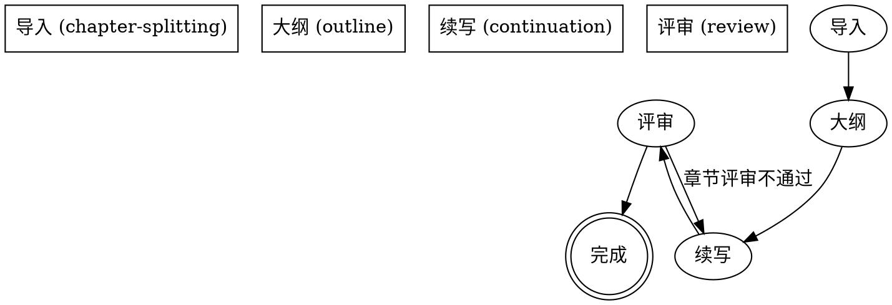

---
name: novel-continuation
description: >
  Use when the user wants to continue, expand, or import an existing
  novel. Entry skill that routes to one of four sub-skills:
  chapter-splitting (stage 1: import), outline (stage 2: analysis +
  outline), continuation (stage 3: serial writing), review (stage 4:
  quality audit). For resumption, reads meta/_project-meta.json to
  detect the current state and route to the appropriate sub-skill.
---

# 小说续写技能族

包含 4 阶段：导入 → 大纲 → 续写 → 评审。每个阶段一个独立子技能，按需触发。

## 何时使用

- 用户说"续写"、"继续写"、"导入小说" → 引导到 chapter-splitting
- `novel-projects/` 中已有 `meta/_project-meta.json` → 读取 currentStep 路由到对应子技能
- 任意阶段需要恢复 → 路由到对应子技能（子技能自身做恢复点探测）

## 核心工作流（总览）



## 4 个子技能

| 阶段 | 技能 | 何时调用 |
|------|------|---------|
| 1 | `chapter-splitting` | 提供小说文件 / 恢复未完成项目 |
| 2 | `outline` | 已拆分，需要分析+大纲 |
| 3 | `continuation` | 大纲已批准，开始写作 |
| 4 | `review` | 章节评审 / 全局质量循环 |

## 项目目录结构

```
novel-projects/
  [项目名称]/
    meta/
      _project-meta.json
      02-写作计划.json
    design/
      00-人物档案.md
      01-大纲.md
      03-世界设定书.md
      04-时间线.md
      05-术语表.md
      06-核心驱动.md
      98-写作决策日志.md
      99-冲突日志.md
      style-guide.md
    chapters/
      第XX章-标题.md
      _markers.md
      _review-第XX章.md
    truth/
      world-state.json
      character-matrix.json
      resource-ledger.json
      chapter-summaries.json
      subplot-board.json
      emotional-arcs.json
      pending-hooks.json
```

## 状态契约

| currentStep | 含义 | 下一阶段 |
|------------|------|---------|
| (无) | 未开始 | chapter-splitting |
| import-done | 导入完成 | outline |
| answers-ready | 已回答 2 个问题 | outline |
| outline-ready | 大纲已生成 | outline |
| constraint-docs | 约束文档已强化 | continuation |
| writing | 写作中 | continuation / review |
| writing-paused | 写作被用户暂停 | continuation（恢复） |
| quality-loop | 质量循环中 | review |
| report-ready | 完成报告 | [终态] |

## 关键原则

1. **chapter-splitting 是强制入口** - 只要用户提供文件，必须先执行 0-A 导入流程
2. **逐章写作禁止提问** - 一旦开始第 4 步，必须连续完成所有章节
3. **只使用串行模式** - 不使用并行或 Teams 模式
4. **质量循环自动修订** - 写作完成后自动审计修订，不询问用户
5. **约束文档体系** - 12 个约束文档（5 design/*.md + 7 truth/*.json）保证一致性

## 通用红旗

- 跳过 chapter-splitting → 禁止
- 在续写中向用户提问 → 禁止
- 完成一章后停止等指令 → 禁止
- 跳过质量循环 → 禁止
- 修改约束文档后未更新真相文件 → 禁止

## 子技能详细文档

- `chapter-splitting/SKILL.md` - 阶段 1 完整流程
- `outline/SKILL.md` - 阶段 2 完整流程
- `continuation/SKILL.md` - 阶段 3 完整流程
- `review/SKILL.md` - 阶段 4 完整流程
