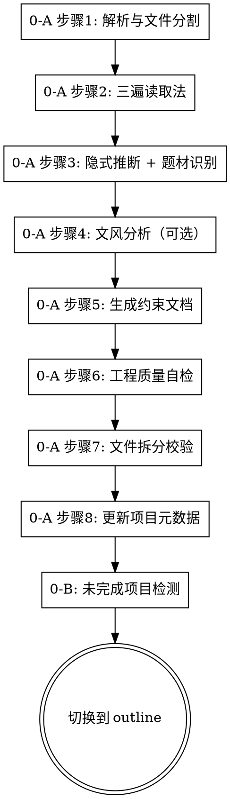

# 章节拆分技能（第 0 步）

## 概述

负责现有小说的导入与三遍读取分析。文件分割 → 三遍读取法 → 隐式推断（含题材识别） → 文风分析 → 约束文档生成 → 质量自检 → 拆分校验 → 确认门。支持未完成项目的检测与恢复。

**职责范围：本技能仅负责 0-A 导入 + 0-B 恢复检测。** 不涉及大纲生成、写作、评审。

**通用红旗与全局交互点清单见 `novel-continuation/SKILL.md`。**

## 何时使用

- 用户说"导入这部小说"、"续写这部小说"
- 用户提供现有小说文件/文本
- `novel-projects/` 中有未完成的 `meta/_project-meta.json` 项目需要恢复
- 用户说"从中断的地方继续"

**不要用于：**
- 编辑现有文本
- 从零开始创作新故事（应使用 outline 技能的前置分析）
- 已完成拆分，仅需分析或续写（应使用 outline / continuation 技能）

## 核心工作流（仅 0-A 和 0-B）



> 🖼️ **流程图强制检查：执行每一步之前，必须先对照上方的流程图，确认当前所处的节点。只有确认后，才能进入该步骤。**
>
> ℹ️ **流程图边界：本技能不包含"逐章写作 / 质量循环 / 完成报告"等节点——这些由 continuation 和 review 技能负责。** 本流程图只覆盖 0-A 和 0-B。

## 写前确认（进入 0-A 前必须执行）

**对照流程图确认：你正处于"0-A 步骤1: 解析与文件分割"节点。**

> 🔴 **第0步是唯一合法的起始入口。如果用户提供了文件，你不处于任何其他节点。不存在"先分析再导入"的路径。**
>
> ℹ️ **编码要求：** 本技能所有对原小说原文文件（包括原始文本文件和拆分后的章节文件）的读取/写入操作，**统一默认使用 UTF-8 编码**。创建新文件（章节、设计文档、真相文件等）时，同样使用 UTF-8 编码。
>
> 📝 **运行日志：** 每完成一个步骤，立即向 `meta/_run-log.jsonl` 追加一行 `{"event": "step_done", "step": "0-A.N", "timestamp": "..."}`。

## 第 0 步 0-A：导入现有小说

**🔴 只要用户提供了任何文件或文本内容，必须先执行本步骤。这是硬性要求，不可跳过。**

**🔴 以下行为已被证实会导致跳过第0步，因此明确禁止：**

| ❌ 禁止的行为 | 为什么禁止 | ✅ 正确做法 |
|-------------|-----------|------------|
| "我已经通读过文件内容了，不需要再导入" | 通读不替代结构化文件分割和约束文档生成 | 即使读完也必须执行完整的文件分割和三遍读取法 |
| "这个功能是高级/可选的，我先走基础流程" | 导入不是"高级功能"，它是第0步强制入口 | 导入流程已内联在0-A中，必须执行 |
| "我先分析一下，导入之后再补" | 分析必须在导入之后，顺序不可颠倒 | 先完成0-A所有步骤，再进入分析阶段 |
| "这只是片段/摘要，不需要拆分章节" | 任何文件无论大小都必须走完整流程 | 无章节标记则存为单一参考文件 |
| "我熟悉这个技能，不需要重新读" | 技能版本可能已更新 | 每次使用必须完整阅读当前版本的 SKILL.md |

### 0-A 步骤1：解析与文件分割（使用 UTF-8 编码）

**步骤1前置判断：从原文路径推断项目名称，检测工程是否已存在**

1. **从原文文件路径推断项目名称**：
   - 原文文件路径是 `novel-projects/[项目名称]/...` 格式 → 其父目录名称即为项目名称
   - 原文文件不在 `novel-projects/` 目录下 → 不触发校对逻辑，直接执行完整拆分

2. **检查项目目录是否已存在**：
   - 检查 `novel-projects/[项目名称]/chapters/` 目录是否存在且有 `.md` 文件
   - 检查 `novel-projects/[项目名称]/meta/_project-meta.json` 是否存在

3. **如果工程已存在且有已拆分的章节文件** → **执行校对流程**（不重新拆分）：

   a. **读取元数据**：读取 `meta/_project-meta.json`，获取章节列表和上次记录的文件信息

   b. **校对检查清单**（逐项核对）：
   | 检查项 | 方法 | 通过标准 |
   |-------|------|---------|
   | 章节文件存在 | 检查 `chapters/` 下每个已记录文件是否存在 | 全部存在 |
   | 内容非空 | 检查每个文件大小 > 0 | 全部非空 |
   | 章节数量一致 | 原文中的章节标记数 vs 已拆分文件数 | 数量一致 |
   | 文件命名规范 | 文件名格式为 `chapters/第XX章-标题.md` | 全部命名符合规范 |
   | 章节顺序正确 | 文件按章节编号连续，无跳号/重号 | 编号连续且与原文一致 |
   | 首尾完整 | 每章开头和结尾与原文对应段落一致 | 无截断 |

   c. **核对结果处理**：
   - ✅ **全部通过** → 确认工程有效，**跳过拆分操作**，直接进入步骤5（确认文件系统状态）→ 然后进入 0-A 步骤2（三遍读取法）
   - ❌ **有缺失/损坏文件** → 仅重新生成缺失/损坏的章节文件，不全部重新拆分
   - ❌ **章节数不匹配**（原文新增/删减了章节）→ **覆盖执行完整拆分**

   d. **更新 `meta/_project-meta.json`**：追加 `lastVerifiedAt` 时间戳，记录校对结论

4. **如果工程不存在，或需完整拆分** → 执行原有拆分逻辑：

   a. **用 UTF-8 编码读取原文文件**，检查文件内容是否包含章节标记（`第X章`、`Chapter X`、`第X卷` 等）
      - **有章节标记** → 按标记分割为独立章节文件，每章文件**用 UTF-8 编码写入**保存到 `chapters/` 目录，文件名为 `chapters/第{XX}章-{标题}.md`
      - **无章节标记**（如剧情摘要、设定文档）→ 将整个文件作为 `chapters/第000章-原文.md`（UTF-8 编码）保存

   b. **创建 `meta/_project-meta.json`** - 写入项目元数据（**包含 config 字段和 genre 字段，默认值见入口 SKILL.md**）

   c. **创建 `meta/02-写作计划.json`** - 章节状态统一标记为 **`"pending"`**（**禁止使用 `"completed"`**——`completed` 只表示"已通过评审"，详见入口 SKILL.md 状态字段规范）

   d. **创建 `meta/_run-log.jsonl`** - 初始化为空文件

   e. **确认以上文件已写入文件系统**

**写入运行日志：** 追加 `{"event": "import_done", "mode": "full_split"|"verify", "chapters": N, "timestamp": "..."}`

### 0-A 步骤2：三遍读取法（核心逆向工程，使用 UTF-8 编码读取原文）

**第一遍：速读标记（通览全貌）**
- 从头到尾快速通读（使用 UTF-8 编码读取每章文件），不做详细提取
- 按以下类别标记关键段落位置：
  - `[S]` 设定声明（"在这个世界，魔法需要等价交换"）
  - `[C]` 角色关键行为（超出预期的行动或决策）
  - `[T]` 时间标记（"三日后"、"一年前"）
  - `[N]` 专有名词首次出现
  - `[H]` 伏笔/悬念（未回收的线索）
  - `[X]` 疑似矛盾（前后说法不一致）
- **输出：** `chapters/_markers.md` — 每章关键标记位置索引

**第二遍：精提取（逐章构建）**
- 逐章回读标记位置，提取到对应约束文档草稿：
  - `[S]` 设定声明 → `design/03-世界设定书.md` 草稿，保留原文引用
  - `[C]` 角色行为 → `design/00-人物档案.md` 草稿，标注行为模式
  - `[T]` 时间标记 → `design/04-时间线.md` 草稿
  - `[N]` 专有名词 → `design/05-术语表.md` 草稿
  - `[H]` 伏笔/悬念 → `design/06-核心驱动.md` 草稿「读者期待债务」
  - `[X]` 疑似矛盾 → `design/99-冲突日志.md`
- **输出：** 5个约束文档草案 + 冲突日志

**第三遍：交叉校验（发现并记录矛盾）**
- 将草稿与原文交叉比对，重点关注：
  - **时间线连贯性**：事件时间标记是否一致
  - **设定一致性**：世界观规则前后是否矛盾
  - **角色一致性**：角色行为模式是否一致
  - **术语拼写**：专有名词拼写是否统一
- **输出：** 约束文档定稿 + 冲突日志更新

### 0-A 步骤3：隐式设定推断 + 题材识别

从叙事模式中推断未显式陈述的设定，标注证据等级：

| 推断类别 | 原文线索 | 提取规则 | 证据标注 |
|---------|---------|---------|---------|
| 角色性格 | "他犹豫了一下，还是没说话" | 同类行为出现≥3次 → 推断为性格特质 | `[证据: 第X章、第Y章、第Z章]` |
| 社会规则 | "没人敢直视皇帝" | 多角色表现相同的敬畏 → 推断为隐性规则 | `[推断: 基于3次独立观察]` |
| 力量等级 | "他一招击败了筑基巅峰的对手" | 跨级战斗力表现 → 推断力量体系边界 | `[推测: 需后续章节验证]` |
| 经济体系 | "一枚灵石够一家三口生活一个月" | 反复出现的购买力数据 → 推断物价体系 | `[均值: 基于N次采样]` |
| 关系变化 | 角色A对角色B的态度从恭敬变为轻蔑 | 跟踪语气/行为变化曲线 → 推断关系转折点 | `[转折: 第X章]` |

**输出规则：**
- 低确信度 → `[推测: 需验证]`，续写时不作为硬约束
- 高确信度（≥3处独立证据）→ `[已确认]`，作为硬约束
- 所有推断必须在对应约束文档中标注证据来源

**题材识别（新增，必须执行）：**

根据原文特征判断题材，写入 `meta/_project-meta.json.config.genre`：

| 题材关键词（原文出现） | genre 值 |
|---------------------|----------|
| 修真、仙门、灵根、筑基、渡劫、元婴 | `xianxia` |
| 斗气、魔法、魔兽、骑士、剑士 | `xuanhuan` / `qihuan` |
| 城市、公司、股票、警方、办公室 | `dushi` |
| 古代、皇宫、科举、战场、王朝 | `lishi` |
| 星际、AI、机器人、未来、飞船 | `kehuan` |
| 案件、推理、嫌疑人、侦探、凶手 | `xuanyi` |
| 系统、属性、面板、升级、商城 | `litrpg` |
| 末日、废土、丧尸、辐射、避难所 | `mori` |
| 多个关键词同时出现 | 取主要题材（出现频次最高） |
| 无明确关键词 | `"general"` |

**题材识别失败 → 写入 `genre: "general"`，由 review 技能按通用维度审计。**

### 0-A 步骤4：文风分析（仅当用户提供参考文风时执行）

**触发条件：**
- 用户在 0-A 前明确提供参考文本（如"按这本书的文风续写"）
- 推断为某作者的典型风格

**如触发则执行，否则跳过：**

1. **读取参考文本文件**（如有）
2. **分析文风特征**：
   - 词汇特征：常用词汇、词汇丰富度、用词偏好
   - 句式特征：平均句长、短句/长句比例、句式变化
   - 节奏特征：段落长度、对话密度、场景切换频率
   - 语调特征：正式/口语、幽默/严肃、文雅/粗犷
3. **生成文风指南** (`design/02-风格指南.md`)：
   ```markdown
   # 文风指南 - [作者名/文本名]
   
   ## 词汇特征
   - 常用词：...
   - 避免词：...
   - 词汇丰富度：...
   
   ## 句式特征
   - 平均句长：...
   - 短句比例：...
   - 特殊句式：...
   
   ## 节奏特征
   - 段落长度：...
   - 对话密度：...
   - 场景切换：...
   
   ## 语调特征
   - 语气：...
   - 修辞手法：...
   - 独特风格标记：...
   ```
4. **保存到项目目录**
5. **文风审计**（在 continuation 章节评审门执行）：
   - [ ] 用词是否符合参考文本特征？
   - [ ] 句长分布是否接近？
   - [ ] 节奏感是否一致？
   - [ ] 语调是否匹配？

> 📌 **职责变更说明：** 文风分析原属 outline 技能"高级功能"。**现统一归到 chapter-splitting 0-A 步骤4**（仅在用户提供参考文风时执行）。outline 不再重复。

### 0-A 步骤5：生成约束文档

**强制生成清单（必选 5 design + 7 truth，共 12 个文件）：**
- [ ] `design/00-人物档案.md` — 完整人物档案，含弧线规划和关系网
- [ ] `design/01-大纲.md` — 章节规划（**注意**：本文件由 outline 技能第 3 步生成时为续写章节填充；0-A 阶段只生成占位骨架）
- [ ] `design/03-世界设定书.md` — 世界观规则和设定（含原文引用和证据等级）
- [ ] `design/04-时间线.md` — 事件时间线（含时间标记和跨章跨度）
- [ ] `design/05-术语表.md` — 专有名词表（含首次出现章节和备注）
- [ ] `design/06-核心驱动.md` — 主线/支线/伏笔追踪（含读者期待债务）
- [ ] `design/99-冲突日志.md` — 跨章设定矛盾记录

**逆向工程真相文件（保存到 `truth/` 目录）：**
- [ ] `truth/world-state.json` — 世界状态
- [ ] `truth/character-matrix.json` — 角色关系矩阵
- [ ] `truth/resource-ledger.json` — 资源账本
- [ ] `truth/chapter-summaries.json` — 章节摘要
- [ ] `truth/subplot-board.json` — 支线进度板
- [ ] `truth/emotional-arcs.json` — 情感弧线
- [ ] `truth/pending-hooks.json` — 待处理钩子

**按题材激活（可选）：**
- [ ] `design/02-风格指南.md`（仅当 0-A 步骤4 触发时）
- [ ] `truth/数值系统.json`（仅 xianxia / xuanhuan / litrpg / mori）
- [ ] `truth/年代考据.json`（仅 dushi / lishi）

**运行时追加（按需）：**
- [ ] `design/98-写作决策日志.md`（续写时遇不确定才创建）

**约束文档分类总览见 `novel-continuation/SKILL.md` 的"约束文档分类"。**

**增量式提取策略（50+章长文本适用）：**

当小说章节超过50章时，以每10章为一个处理块：
```
FOR each 块 in 章节列表:
    1. 在块内执行「三遍读取法」（速读标记 → 精提取 → 交叉校验）
    2. 生成该块的子约束文档（带块编号）
    3. 将该块结果合并到主约束文档
    4. 执行「块间冲突检测」：对比新块与已有主文档的设定是否冲突
    5. 如有冲突 → 写入 design/99-冲突日志.md，标注双方章节位置
    6. 更新主约束文档
```

### 0-A 步骤6：工程质量自检

**所有约束文档生成后，必须逐项确认：**

| 检查项 | 说明 | 通过标准 |
|-------|------|---------|
| 设定完整性 | 所有显式设定的世界观规则已提取 | 无遗漏已知规则 |
| 证据可追溯 | 每条提取的设定标注了原文章节位置 | 可追溯到具体章节 |
| 推断标注 | 所有隐式推断标注了`[推断]`或`[已确认]` | 无未标注推断 |
| 冲突已记录 | 跨章矛盾已写入冲突日志 | 冲突日志非空或声明"无冲突" |
| 时间线无断裂 | 每章至少有一个时间参考点 | 无完全无时间标记的章节 |
| 术语表完整 | 所有专有名词统一收录 | 无遗漏高频术语 |
| 角色覆盖 | 所有出场≥3次的角色已建档 | 无遗漏角色 |
| 伏笔无遗漏 | 所有明显伏笔已录入期待债务 | 无未追踪的伏笔 |
| 题材识别 | `config.genre` 已设置 | 非空字符串 |

**全部通过 → 标记逆向工程完成。有未通过项 → 回到对应的提取阶段补充。**

### 0-A 步骤7：文件拆分校验

> 📌 **校对模式说明：** 如果 0-A 步骤1 的前置判断中已确认工程存在且校对通过，则拆分校验已在步骤1中完成。此处直接标记"校对通过"，无需重复执行。

| 检查项 | 说明 | 通过标准 |
|-------|------|---------|
| 拆分完整性 | 所有章节均被正确分割，章节数与原文件一致 | 每章一个独立文件（或步骤1校对已确认） |
| 内容一致性 | 拆分后章节文件拼接回原文，逐段比对无差异 | 拼接内容与源文件完全一致（或步骤1校对已确认） |
| 文件命名规范 | 文件名格式为 `chapters/第XX章-标题.md` | 所有文件命名符合规范（或步骤1校对已确认） |
| 章节顺序正确 | 文件按章节顺序编号，无跳号/重号 | 编号连续且与原文顺序一致（或步骤1校对已确认） |
| 首尾完整 | 每章文件开头和结尾无截断 | 与原文对应段落首尾一致（或步骤1校对已确认） |

**通过 → 导入完成，所有拆分文件及约束文档就绪。有未通过项 → 回到步骤1重新分割。**

### 0-A 步骤8：更新项目元数据

**场景A：完整拆分模式（新工程）**
更新 `meta/_project-meta.json`：
- 设 `currentStep: "import-done"`
- 将所有新建文件名（含子目录前缀）追加到 `filesCreated`
- 初始化 `config` 字段（默认值见 `novel-continuation/SKILL.md`）
- `config.genre` 来自步骤3的题材识别结果
- 更新 `updatedAt`

**场景B：校对模式（工程已存在）**
更新 `meta/_project-meta.json`：
- 设 `currentStep: "import-done"`
- 追加 `lastVerifiedAt` 时间戳
- 追加 `verificationResult: "passed"` 或记录具体修复项
- 如发现缺失文件被重新生成，追加到 `filesCreated`
- 更新 `updatedAt`

**`importStage` 字段：** 在 `meta/_project-meta.json` 增加 `importStage` 字段。字段值为当前进度：`"step1" | "step2" | "step3" | "step4" | "step5" | "step6" | "step7" | "step8" | "done"`。每完成一步立即更新。完成时设为 `"done"`。

### ✅ 0-A 导入完成确认门（进入 0-B 前必须停在此处）

**输出以下确认信息（根据模式选择对应输出），确认后才能进入 0-B：**

**完整拆分模式：**
```
✅ 第0步 0-A 导入确认（完整拆分）
- 文件分割：[X] 章已拆分保存到 chapters/
- 写作计划：meta/02-写作计划.json（[X] 章标记为 pending）
- 角色档案：design/00-人物档案.md
- 世界设定：design/03-世界设定书.md
- 时间线：design/04-时间线.md
- 术语表：design/05-术语表.md
- 核心驱动：design/06-核心驱动.md
- 冲突日志：design/99-冲突日志.md
- 题材识别：config.genre = [genre]
- 真相文件：truth/ 下 7 个 JSON 已就绪
- 自检结果：全部通过
- 拆分校验：全部通过
- 运行日志：meta/_run-log.jsonl（[N]条记录）
```

**校对模式（工程已存在）：**
```
✅ 第0步 0-A 导入确认（校对模式）
- 操作方式：[已存在工程，执行校对]
- 拆分操作：[跳过，章节文件已存在]
- 章节文件：[X] 章存在于 chapters/
- 校对结论：[全部通过 / 已修复 X 个问题]
- 最后验证时间：[时间戳]
- 约束文档：design/ 已就绪（如存在则复用）
- 真相文件：truth/ 已就绪（如存在则复用）
- 题材识别：config.genre = [genre]（保留/更新）
- 自检结果：全部通过
- 运行日志：meta/_run-log.jsonl（[N]条记录）
```

## 0-B：未完成项目检测

**补充说明（添加到 0-B 顶部）：** 检测时优先读 `importStage` 字段，若存在则比 0-B 原表更精确的恢复。**全局恢复决策树见 `novel-continuation/SKILL.md`（按 `currentStep` 路由到对应子技能）。本节只描述"项目刚进入 0-A 但中断"的情况。**

**开始执行前：**

1. **扫描项目目录**（`./novel-projects/`）
2. **检查未完成项目**：
   - 查找包含 `meta/_project-meta.json` 或 `meta/02-写作计划.json` 的项目
   - 读取 `meta/_project-meta.json` 获取 `currentStep`（如不存在则从 `meta/02-写作计划.json` 推断）
   - 检查 `02-写作计划.json.status` 是否为 `"in_progress"`、`"paused"`、`"auditing"` 或 `"failed"`
   - 检查是否有章节 `status != "pending" / "completed"`（如有 `meta/02-写作计划.json`）

3. **如果找到未完成项目**：
   - 展示项目信息：小说名称、当前 `currentStep`、完成进度（X/Y 章已完成）
   - 读取 `meta/_project-meta.json` 确定恢复点：

   | `currentStep` | 状态 | 恢复目标 | 附带操作 |
   |--------------|------|---------|---------|
   | (无) / `importStage` 未完成 | 0-A 中断 | 跳到 `importStage` 对应步骤 | 读 `importStage` 字段 |
   | `import-done` | 0-A 完成，outline 未开始 | 切换到 outline 第 1 步 | — |
   | `answers-ready` | outline 第 2 步完成 | 切换到 outline 第 3 步 | 用户答案从 `answers` 字段读取 |
   | `outline-ready` | outline 第 3 步完成 | 切换到 outline 第 3-A 步 | `01-大纲.md` 已存在 |
   | `constraint-docs` | outline 第 3-A 步进行中 | 切换到 outline 第 3-A 步 | 补缺失文件 |
   | `writing` | continuation 写作中 | 切换到 continuation | 找第一个非 `completed` 章节 |
   | `writing-paused` | continuation 暂停 | 切换到 continuation | 更新状态为 `writing` |
   | `quality-loop` | review 质量循环中 | 切换到 review | 找缺失 `_review` 或 `_audit` |
   | `report-ready` | 完成报告阶段 | 切换到 review 完成报告 | 直接展示总结 |

   - **本技能仅在 0-A 中断时处理。** 其他阶段由对应子技能处理（路由逻辑见入口 SKILL.md 的"全局恢复决策树"）。
   - 提供选项（**这是全局交互点 #1**）：
     - "继续上次创作" → 按上表精确跳转
     - "重新开始" → 删除该项目目录，进入第1步
   - 如果未找到 → 正常进入第1步

### 完整性校验逻辑（恢复时自动执行）

恢复时，读取 `meta/_project-meta.json` 中的 `filesCreated` 列表，逐一检查：

| 检查项 | 检测方法 | 不通过处理 |
|-------|---------|----------|
| 文件存在 | 检查文件系统 | 标记为缺失，重新生成 |
| 内容非空 | 检查文件大小 > 0 | 标记为空，重新生成 |
| JSON 合法性（仅 JSON 文件） | 尝试 `JSON.parse` | 标记为损坏，重新生成 |
| 关键字段存在（仅 `meta/02-写作计划.json`） | 检查 `status` 和 `chapters` 字段 | 标记为损坏，重新生成 |
| `config.genre` 存在 | 检查 `_project-meta.json.config.genre` | 标记缺失，重新识别 |

**所有缺失/损坏文件重新生成完成后 → 按精确恢复表跳转。**

## ✅ 完成确认门

**0-A 完成时输出确认信息（模板见步骤8末尾），确认后才能切换到 outline 技能。**

## 本阶段特有红旗

通用红旗见入口 SKILL.md。**以下为本阶段特有：**

- **"我已经通读/浏览过文件内容了，不需要再导入"** → 通读不替代结构化导入。0-A 必须执行文件分割、三遍读取法和约束文档生成。已读内容越详细，越说明需要导入来结构化这些信息。
- **"这个功能是高级/可选的，我先走基础流程"** → 导入不是"高级功能"。0-A 是第0步强制入口，不是可选功能。
- **"先做分析/大纲，导入之后再补"** → 0-A 是前置条件，不完成不得进入任何后续步骤。流程图明确画着：0-A → 0-B → 切换到 outline。
- **"我只是快速看一下文件结构"** → 查看文件是0-A的一部分，但0-A 不止于此。查看后必须完成全部导入流程。
- **章节状态字段误用 `"completed"`** → 校对场景必须用 `"pending"`（详见入口 SKILL.md 状态字段规范）。
- **题材识别由 AI 主观决定** → 严格按 0-A 步骤3 关键词表机械识别，不靠"感觉"。

## 异常决策树（本章特有）

通用异常决策树见 `novel-continuation/SKILL.md` 末尾。**本章特有补充：**

| 异常 | 决策 |
|------|------|
| 原文为图片/PDF | 提示用户提供文本文件 |
| 原文编码非 UTF-8 | 转换编码后再处理（保留原文件备份） |
| 章节标记混乱（"第一章"/"第1章"/"Chapter 1" 混用） | 按出现顺序统一为 `第X章`，记录转换映射到决策日志 |
| 工程部分损坏（部分章节文件丢失） | 走"缺失/损坏文件"分支，仅重生成缺失项 |
| 题材关键词冲突（如"修真 + 都市"） | 取主题材（频次最高），副题材写入 `config.secondaryGenre` 数组 |
