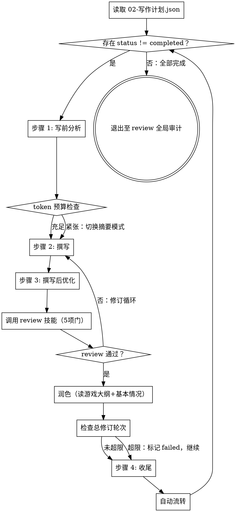

# 续写技能（第 4 步）

## 概述

负责大纲批准后的逐章写作。串行模式，无中断写作区段，每章完成后调用 review 技能把关质量。本技能**仅负责章节的创作与流转**，不包含质量把关的具体规则——这些由 review 技能统一负责。

**职责划分：**
- 本技能（continuation）：写前分析 → 撰写 → 撰写后优化 → 收尾 → 自动流转
- review 技能：5 项章节门（写入 `review/_review-第N章.md`）+ 33 维全局审计（写入 `audit/_audit-第N章.md`）

**重要原则：** 从第4步开始到全部章节完成，AI 处于无中断写作区段，禁止向用户发送任何消息、禁止使用 AskUserQuestion、禁止停下来等待确认。所有章节必须一次写完才能与用户对话。

**通用红旗与全局交互点清单见 `novel-continuation/SKILL.md`。**

## 何时使用

**使用条件：**
- 大纲已批准（`design/01-大纲.md` 存在且 `meta/02-写作计划.json.chapters` 非空）
- 6 个 `design/*.md` 已生成（大纲 + 5 约束文档，按 `config.genre` 可能含风格指南）
- 7 个 `truth/*.json` 已生成（如果从现有小说续写）
- `meta/_project-meta.json.currentStep == "writing"`
- `meta/02-写作计划.json.status == "in_progress"`
- 用户说"开始写"、"写下一章"、"继续创作"、"开始第 N 章"

**不要用于：**
- 大纲未生成 → 应先使用 outline 技能
- 章节质量把关 → 应使用 review 技能
- 全局质量循环 → 应使用 review 技能
- 整体架构评估 → 应使用 review 技能
- 完成报告 → 应使用 review 技能

## 核心工作流



## 写前确认

按 `novel-continuation/SKILL.md` 的"写前确认通用模板"检查：
- [ ] `meta/_project-meta.json.currentStep == "writing"` 或上一章已完成
- [ ] 6 个 `design/*.md` 已生成（含 `01-大纲.md`）
- [ ] 7 个 `truth/*.json` 已生成（如适用）
- [ ] `meta/02-写作计划.json.chapters` 至少有一个 `status != "completed"`
- [ ] `meta/_project-meta.json.updatedAt` 已更新为当前时间
- [ ] `config.genre` 已设置
- [ ] `meta/_run-log.jsonl` 可写

## 恢复点表

**章节级恢复（用于续写中断后恢复）：**

```
读 meta/02-写作计划.json.chapters 找第一个 status != "completed" 的章节 N
  ↓
检查 chapters/第N章-*.md 文件状态:
  ├─ 不存在 → 从头写第N章
  ├─ 存在但字数 < config.reviewPassThreshold → 默认续写（保留已写内容并补全到 config.minWordCount+）
  │   └─ 续写前对照 design/01-大纲.md 校验**大纲覆盖度**（核心事件/章节意图/钩子的覆盖率）：
  │       ├─ 覆盖度 ≥ config.outlineCoverageThreshold → 续写
  │       └─ 覆盖度 < config.outlineCoverageThreshold → 写入 design/98-写作决策日志.md 并重写
  └─ 存在且字数 ≥ config.reviewPassThreshold → 检查 review/_review-第N章.md
      ├─ 不存在 → 调用 review 技能（5项门）
      ├─ 存在且 status == "passed" → 找下一章
      └─ 存在但 status == "failed" → 检查总修订轮次
          ├─ 章节门轮次 + 后续质量循环轮次 < config.maxTotalRevisionPerChapter → 修订
          └─ 超限 → 标记 status: "failed"，继续下一章
```

**章节状态字段：** `meta/02-写作计划.json.chapters[i].status ∈ { "pending", "in_progress", "completed", "failed" }`。中断时保持 `in_progress`，完成后才写 `completed`。

**大纲覆盖度阈值定义：** 对照 `design/01-大纲.md` 中本章规划，统计已写内容覆盖的规划要点（核心事件、章节意图、悬念钩子、出场人物等）占比。覆盖度 = 已覆盖规划要点数 / 总规划要点数。≥ `config.outlineCoverageThreshold`（默认 0.7）视为可续写，< 阈值应重写并记录决策日志。

---

## 无中断写作区段（核心机制）

**从本步骤开始到全部章节完成，AI 处于「无中断写作区段」：禁止向用户发送任何消息，禁止使用 AskUserQuestion，禁止停下来等待确认。所有章节必须一次写完才能与用户对话。**

**进入第4步时：**
1. 更新 `meta/_project-meta.json`，设 `currentStep: "writing"`，更新 `updatedAt`
2. 写入 `meta/_run-log.jsonl`：`{"event": "enter_writing_zone", "chapters": N, "timestamp": "..."}`
3. 确认 `meta/02-写作计划.json.status == "in_progress"`（不是就改为 `in_progress`）

### 强制机制

**规则 1：无中断写作区段**
从第4步「逐章写作」开始，到所有章节完成，AI 与用户之间零交互。此区段内任何需要决策的点，写入 `design/98-写作决策日志.md` 推迟到完成报告时处理。

**规则 2：章节自动流转**
每章的最后一个动作不是「更新写作计划」，而是「自动认领并启动下一章」。不存在"本章已完成，等待指令"的间隙。

**规则 3：决策缓冲**
写作中遇到"是否应该……"的不确定性时：
1. 在 `design/98-写作决策日志.md` 中记录：章节、问题、选择及其理由
2. 按直觉选择一种方案继续写作，不停顿
3. 所有待定决策在完成报告时一次性向用户说明，由用户决定是否修订

**规则 4：章节间零间隔**
完成一章的「更新写作计划」后，不输出任何内容给用户，不等待，不确认，立即读取下一章信息并开始创作。

**规则 5：质量把关由 review 技能承担**
每章完成后，AI 不自行进行综合质量审计——而是按自动流转机制调用 review 技能。AI 不在章节间主观判断"通过/不通过"，避免主观判断导致的停顿。

### 执行流程

```
WHILE meta/02-写作计划.json 中存在 status != "completed" 的章节:
    执行「逐章创作流程」（步骤 1-4）
    ⚠️ 关键：步骤 4（收尾）的最后一步是「自动流转至下一章」——这是每章的最后一步
    执行自动流转后，循环自动进入下一章（无需任何用户交互）
所有章节完成 → 调用 review 技能进入全局 33 维审计
```

---

## Token 预算管理（新增）

**问题：** 长篇续写到第 20+ 章时，每次"写前分析"重读前 5 章原文 + 6 份 design + 7 份 truth，token 消耗爆炸。

**解决方案：两段式读取 + 动态降级。**

### 预算配置（`config.tokenBudget`）

```json
{
  "tokenBudget": {
    "contextWindow": 200000,
    "switchToSummaryOnly": 0.6,
    "forceSummarize": 0.85
  }
}
```

### 读取策略

| 当前累积 token / contextWindow | 读取策略 |
|-------------------------------|---------|
| < 60% | 完整读取前 5 章原文 + 6 design + 7 truth |
| 60% - 85% | 仅读 `truth/chapter-summaries.json` 中前 5 章摘要 + 6 design（不读 truth 其他 6 份） |
| ≥ 85% | 仅读 `design/01-大纲.md` 本章规划 + `truth/chapter-summaries.json` 上一章摘要 |

### 切换机制

- 每章写前分析开始时，估算当前上下文 token（粗略：累计文件字符数 / 2.5）
- 根据上表选择读取策略
- 切换到摘要模式时，写入运行日志：`{"event": "token_mode_switch", "from": "full", "to": "summary", "contextRatio": 0.65, "timestamp": "..."}`

### 偏差检测

- 即使在摘要模式下，写完后**必须**做一次"5 章摘要与本章开头的连贯性检查"
- 如果检测到偏差，回退读取原文（即使超出 60% 阈值也允许一次性的"超限读取"）
- 记录决策日志：`{"event": "context_reload", "reason": "coherence_check_failed", "timestamp": "..."}`

---

## 逐章创作流程（所有章节共用）

### 步骤 1: 写前分析（必须执行）

**🔴 续写前一章前，必须先回顾前一章（N-1）的全部质量记录和整体小说状态，确保连贯性。**

0. **前章回顾与整体校验（第1章无前一章时跳过）：**
   - **读取前一章的大纲**：读取 `outline/第{XX}章-{标题}.md`，确认前一章的规划要点是否已全部完成
   - **读取前一章的评审结果**：读取 `review/_review-第{XX-1}章.md`，了解前一章评审是否通过，有无遗留问题
   - **读取前一章的审计结果**：如前一章已有 33 维审计，读取 `audit/_audit-第{XX-1}章.md`，关注不合格维度
   - **整体小说回顾**：读取 `truth/chapter-summaries.json` 全部章节摘要，回顾整体叙事弧线；读取 `design/06-核心驱动.md` 确认主线/支线/伏笔追踪状态；读取 `design/99-冲突日志.md` 检查待解决矛盾
   - **连贯性断言**：确认当前章节的起笔与前一章结尾无逻辑断裂、无设定矛盾、无人物 OOC；如有问题写入 `design/98-写作决策日志.md`

1. **读取 `meta/02-写作计划.json`** - 查看各章节状态，确定下一个待创作章节
2. **读取 `design/01-大纲.md`** - 找到当前章节的规划信息，提取：
   - 核心事件
   - 承接上章
   - 悬念钩子
   - 出场人物
   - 场景列表
   - 章节意图
3. **读取当前章节的独立大纲**：读取 `outline/第{XX}章-{标题}.md`，获取本章的详细规划（核心事件、场景列表、悬念钩子、章节意图）
4. **读取设计文档**（按 token 预算决定读哪些）：
   - `design/00-人物档案.md` - 本章出场人物详情
   - `design/03-世界设定书.md` - 本章涉及的世界观规则和场景设定
   - `design/04-时间线.md` - 当前章节的时间位置、前后事件衔接
   - `design/05-术语表.md` - 本章涉及的专有名词拼写和定义
   - `design/06-核心驱动.md` - 主线/支线当前状态、需推动的伏笔回收
5. **读取真相文件**（按 token 预算决定读哪些）：
   - `truth/world-state.json` - 世界状态
   - `truth/character-matrix.json` - 角色矩阵
   - `truth/resource-ledger.json` - 资源账本
   - `truth/chapter-summaries.json` - **核心**：前 5 章摘要（替代原文读取）
   - `truth/subplot-board.json` - 支线进度板
   - `truth/emotional-arcs.json` - 情感弧线
   - `truth/pending-hooks.json` - 待处理钩子
6. **前 5 章连贯性检查** - 根据 token 预算选择：
   - 完整模式：读取 `chapters/` 中前 5 章原文，逐章比对人物关系、世界观设定、情节走向与约束文档是否一致
   - 摘要模式：仅读 `truth/chapter-summaries.json`，识别偏差后回退到原文
   - 偏差记录到 `design/98-写作决策日志.md`
7. **提取前 5 章大纲摘要** - 从 `outline/` 目录提取前 5 章的独立大纲文件（或从 `design/01-大纲.md` 回退），整理核心事件、悬念钩子、章节意图、伏笔回收，作为审计基线供 review 技能使用
8. **更新 `meta/02-写作计划.json`** - 将本章 `status` 设为 `"in_progress"`
9. **写入运行日志：** `{"event": "chapter_start", "chapter": N, "title": "...", "timestamp": "..."}`

### 步骤 2: 撰写

1. **创建章节文件（使用 UTF-8 编码）**
   文件名格式：`chapters/第{XX}章-{章节标题}.md`
   标题来自 `meta/02-写作计划.json` 中的 `title` 字段

2. **撰写章首引子** - 按大纲中本章的章首引子类型，参考"章首引子七式"，创作 50-150 字的引子文字

3. **撰写正文** - **严格按照大纲中本章的核心事件、场景列表和章节意图撰写正文**

   **正文要求检查清单：**
   - [ ] **每章必须达到最低 `config.minWordCount` 字**（默认 3000），目标 3000-5000 字，超过 8000 字建议分章
   - [ ] **章首引子**：已创作
   - [ ] **正文开头**：第一段必须使用"十种强力开头技巧"之一，建立即时冲突
   - [ ] **张力节奏**：全章至少 2 个张力波峰，连续 500 字以上无冲突时必须引入新张力
   - [ ] **对话要求**：每章至少 30% 对话内容，每段对话必须有潜台词或推进情节目的
   - [ ] **意外转折**：每章至少 1 个读者预期之外的事件或信息
   - [ ] **人物一致性**：对话和行为必须严格符合步骤 1 提取的角色设定
   - [ ] **约束文档一致性**：新内容不得与约束文档中的已有设定矛盾
   - [ ] **伏笔回收**：必须回收前文设定的伏笔，或明确标记为待回收
   - [ ] **题材特定检查**（按 `config.genre` 激活）：
     - `xianxia` / `xuanhuan` / `qihuan` / `litrpg` / `mori`：力量体系边界检查
     - `dushi` / `lishi`：年代考据检查
     - `xuanyi`：逻辑链自洽检查

   **章节结构模板：**
   ```
   章首引子（可选，50-150字）→
   场景描写（200-300字） →
   人物互动/对话（500-1000字） →
   冲突升级（800-1500字） →
   关键事件（1000-1500字） →
   悬念钩子（章末，100-200字）
   ```

4. **设置结尾钩子** - 按大纲中本章的悬念钩子设计 → 参考"悬念钩子十三式"

5. **字数检查（强制）** - 使用 Bash 命令 `(Get-Content -Path "chapters/第{XX}章-{标题}.md" -Raw) -replace '\s+','' | Measure-Object -Character | Select-Object -ExpandProperty Characters` 统计实际字数。**字数 < `config.reviewPassThreshold` 视为不通过，不得进入后续步骤。**

### 步骤 3: 撰写后优化

1. **连贯性检查** - 人物一致性、情节连贯、节奏控制、约束文档一致性
2. **张力检查** - 检查全章节奏是否有波峰波谷、对话是否有个性、是否有意外转折
3. **深度润色（去除AI味）** - 重点检查并修改：
   - **去除过度修饰的形容词**：删减"璀璨"、"瑰丽"等AI常用词堆砌
   - **减少抽象陈述**：把"心中涌起复杂的情感"改为具体动作/对话
   - **打破四字格律**：避免"心潮澎湃、热血沸腾"等陈词滥调
   - **增加口语化表达**：人物对话要有个性
   - **优化节奏感**：长句短句交替
   - **细节具象化**：用具体细节替代笼统描述
4. **字数检查（强制）** - 再次使用 Bash 命令检查字数。**字数 < `config.reviewPassThreshold` 则回到步骤 2 扩充内容。**
5. **写入运行日志：** `{"event": "chapter_polished", "chapter": N, "wordCount": X, "timestamp": "..."}`

> **步骤 3 完成后，自动调用 review 技能进行 5 项章节评审门把关。** 评审结果写入 `review/_review-第N章.md`。**通过后**执行**润色步骤**（读取 `design/游戏大纲.md` 和 `design/游戏基本情况.md`，进行游戏情景化润色和去AI味处理），然后才能进入步骤 4（收尾）；不通过则进入修订循环。
>
> 📌 **职责说明：** 5 项章节评审门与 33 维审计已拆分（详见 review SKILL.md）。本技能只触发章节门，**不触发 33 维审计**。33 维审计由 review 技能在全部章节完成后统一执行。

### 步骤 4: 收尾

1. **生成章节摘要** - 在 `design/01-大纲.md` 的章节摘要区追加（300-500字，保证连贯性参考）
2. **更新设计文档**（每次写作后必须更新）：
   - 更新 `design/03-世界设定书.md` - 新增的世界观信息或设定补充
   - 更新 `design/04-时间线.md` - 追加本章事件到时间线
   - 更新 `design/05-术语表.md` - 追加本章出现的新专有名词
   - 更新 `design/06-核心驱动.md` - 更新主线/支线进度、回收/新增读者期待债务
3. **更新冲突日志**（如适用）：
   - 如果本章内容解决了某个跨章矛盾 → 在 `design/99-冲突日志.md` 中将对应条目标记为 `[已解决]` 并注明解决章节
   - 如果本章引入了新的设定分歧 → 追加新条目
4. **更新真相文件**（如果从现有小说续写）：
   - 更新 `truth/world-state.json` - 世界状态变化
   - 更新 `truth/character-matrix.json` - 角色关系变化
   - 更新 `truth/resource-ledger.json` - 资源变化
   - **更新 `truth/chapter-summaries.json` - 追加本章摘要（重要！供后续 token 预算摘要模式使用）**
   - 更新 `truth/subplot-board.json` - 支线进度变化
   - 更新 `truth/emotional-arcs.json` - 情感弧线变化
   - 更新 `truth/pending-hooks.json` - 新增悬念、回收悬念
5. **更新 `meta/02-写作计划.json`** - 将本章 `status` 设为 `"completed"`，填入 `wordCount` 和 `revisionHistory` 末尾追加
6. **写入运行日志：** `{"event": "chapter_done", "chapter": N, "wordCount": X, "revised": false, "timestamp": "..."}`

---

## 单章修订总轮次上限

**单章修订总轮次 = 章节门轮次 + 后续 33 维审计轮次 ≤ `config.maxTotalRevisionPerChapter`（默认 5）**

**流转前检查（自动化执行）：**

```
读 review/_review-第N章.md 和 audit/_audit-第N章.md（如有）的轮次信息
  ↓
总轮次 = chapter.revisionHistory.length
  ↓
若 总轮次 ≥ config.maxTotalRevisionPerChapter：
  ├─ 标记 status: "failed"
  ├─ 写入决策日志：{"chapter": N, "maxed": true, "totalRounds": X}
  └─ 继续下一章（不阻塞流程）
否则：正常进入收尾
```

**单章修订轮次分配建议（默认 maxTotalRevisionPerChapter=5）：**
- 章节门：最多 3 轮
- 33 维审计：最多 2 轮
- 总计 ≤ 5

**超过 5 轮的章节** → 完成报告时统一标记，不阻塞流程。

---

## 自动流转至下一章（每章的最后一步，不可跳过）

**🔴 流转前断言（全部通过才能流转，不通过则阻塞）：**

1. **质量把关文件存在检查**：确认 `review/_review-第{XX}章.md` 存在且 `status == "passed"`（由 review 技能生成）。不存在或未通过则阻塞，回到步骤 3 之前重新调用 review 技能。
2. **润色执行检查**：确认润色步骤已完成（运行日志有 `chapter_polished_after_review` 事件记录）
3. **字数达标检查**：使用 Bash 命令统计字数。**字数 < `config.reviewPassThreshold` 则阻塞流转，回到步骤 2 扩充内容。**
4. **总修订轮次检查**：参见上一节"单章修订总轮次上限"。
5. **写作计划状态检查**：读取 `meta/02-写作计划.json`，确认本章 `status` 为 `"completed"`。非 completed 则阻塞。
6. **五项断言全部通过后**，才能进入流转。

**执行顺序（断言通过后）：**

1. 读取 `meta/02-写作计划.json`
2. 检查是否存在 `status != "completed"` 的章节：
   - **存在** → 认领该章节（设 `status = "in_progress"`），保存 JSON，**立即开始下一章的「步骤 1: 写前分析」**
   - **不存在** → 所有章节完成，**立即调用 review 技能进入 33 维全局审计**
3. **禁止：** 在此步骤输出任何内容给用户、使用 AskUserQuestion、等待确认、停下来报告进度

---

## 异常中断处理

**异常情况处理：**
- AI 输出超过单章长度限制（如正文超过 8000 字） → 自动分章处理（按场景切分）
  - 文件名：`第N+1章-标题.md`，追加到 `02-写作计划.json.chapters`
  - 写入运行日志：`{"event": "chapter_split", "original": N, "split_into": [N, N+1]}`
- AI 误输出用户对话请求 → 立即停止输出，在 `design/98-写作决策日志.md` 记录，回到当前步骤继续
- AI 检测到无法继续（如大纲严重缺失） → 标记当前章节 `status: "failed"`，写入决策日志，继续下一章
- 章节摘要生成失败 → 重试 1 次；仍失败则写入 `truth/chapter-summaries.json` 为占位"摘要生成失败，请人工补全"

**用户主动停止处理：**
- 用户说"停止"或"暂停" → 立即停止当前动作
- 更新 `meta/_project-meta.json.currentStep` 为 `"writing-paused"`，`02-写作计划.json.status` 改为 `"paused"`
- 写入 `design/98-写作决策日志.md` 一行"中断记录"（时间戳 + 当前章节 + 原因）
- 当前章节保持 `status: "in_progress"` 以便恢复
- 写入运行日志：`{"event": "user_paused", "chapter": N, "timestamp": "..."}`
- 输出"已暂停，恢复点：第N章"信息给用户（**这是无中断区段的唯一例外**——用户主动中断时必须告知）

---

## 本阶段特有红旗

通用红旗见入口 SKILL.md。**以下为本阶段特有：**

- **在写作过程中使用 AskUserQuestion** → 禁止，一旦开始写作
- **完成一章后停止** → 必须立即继续下一章
- **章节间输出任何内容** → 章节间零输出，直接进入下一章创作
- **向用户报告章节进度** → 进度不逐章报告，只最后一次报告
- **在质量把关中询问"是否修订"** → 自动修订，不征求意见
- **遇到不确定时停下来** → 写入写作决策日志，按直觉继续写
- **在章节间主观判断质量** → 章节间不做综合判断，全部由 review 技能把关
- **在续写过程中修改大纲** → 大纲错误应记录到决策日志，不修改大纲本身
- **token 预算紧张时仍读全部原文** → 按"Token 预算管理"章节动态降级
- **章节总修订轮次超限后继续修订** → 标记 `failed`，继续下一章
- **修改约束文档后未更新真相文件** → 双轨必须同步
- **评审通过后跳过润色步骤** → 必须读取游戏大纲+基本情况执行润色和去AI味
- **AI 主观决定题材特定检查项** → 严格按 `config.genre` 激活
- **5 章摘要模式检测到偏差不回退读原文** → 偏差优先，超限读取允许一次
- **续写前未回顾前一章的大纲/评审/审计** → 每次写前分析必须先读 `outline/`、`review/`、`audit/` 中前一章的文件，再读整体小说状态

**所有这些都意味着：从第4步开始到全部章节完成，AI 处于封闭写作模式。零用户交互。不提问。不停顿。不报告进度。写完 ALL 再说话。**
