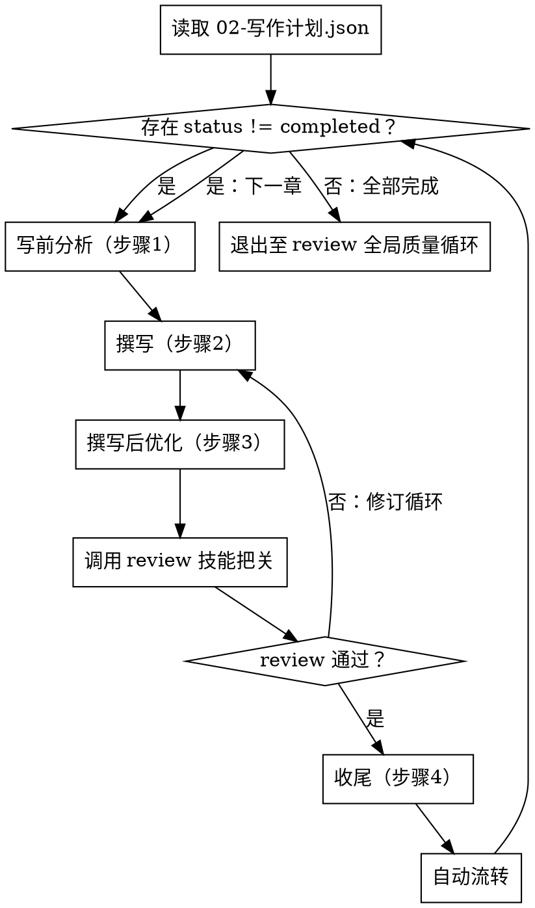

# 续写技能（第 4 步）

## 概述

负责大纲批准后的逐章写作。串行模式，无中断写作区段，每章完成后调用 review 技能把关质量。本技能**仅负责章节的创作与流转**，不包含质量把关的具体规则——这些由 review 技能统一负责。

**职责划分：**
- 本技能（continuation）：写前分析 → 撰写 → 撰写后优化 → 收尾 → 自动流转
- review 技能：综合质量检查（人物一致性、世界观一致性、上下文对齐、悬念钩子质量、质量基线、整体质量审计）

**重要原则：** 从第4步开始到全部章节完成，AI 处于无中断写作区段，禁止向用户发送任何消息、禁止使用 AskUserQuestion、禁止停下来等待确认。所有章节必须一次写完才能与用户对话。

## 何时使用

**使用条件：**
- 大纲已批准（`design/01-大纲.md` 存在且 `meta/02-写作计划.json.chapters` 非空）
- 5 个 `design/*.md` 已生成（大纲 + 4 个约束文档）
- 7 个 `truth/*.json` 已生成（如果从现有小说续写）
- `meta/_project-meta.json.currentStep == "writing"`
- 用户说"开始写"、"写下一章"、"继续创作"、"开始第 N 章"

**不要用于：**
- 大纲未生成 → 应先使用 outline 技能
- 章节质量把关 → 应使用 review 技能
- 全局质量循环 → 应使用 review 技能
- 整体架构评估 → 应使用 review 技能
- 完成报告 → 应使用 review 技能

## 核心工作流



## 写前确认

进入第4步前，逐项核对：

- [ ] `meta/_project-meta.json.currentStep == "writing"` 或上一章已完成
- [ ] 5 个 `design/*.md` 已生成（`01-大纲.md`、`02-人物档案.md`、`03-世界设定书.md`、`04-时间线.md`、`05-术语表.md`、`06-核心驱动.md`）
- [ ] 7 个 `truth/*.json` 已生成（如从现有小说续写：`world-state.json`、`character-matrix.json`、`resource-ledger.json`、`chapter-summaries.json`、`subplot-board.json`、`emotional-arcs.json`、`pending-hooks.json`）
- [ ] `meta/02-写作计划.json.chapters` 至少有一个 `status != "completed"`
- [ ] `meta/_project-meta.json.updatedAt` 已更新为当前时间

## 恢复点表

**章节级恢复（用于续写中断后恢复）：**

```
读 meta/02-写作计划.json.chapters 找第一个 status != "completed" 的章节 N
  ↓
检查 chapters/第N章-*.md 文件状态:
  ├─ 不存在 → 从头写第N章
  ├─ 存在但字数 < 2500 → 默认续写（保留已写内容并补全到 3000+）
  │   └─ 续写前对照 design/01-大纲.md 校验**大纲覆盖度**（核心事件/章节意图/钩子的覆盖率）：
  │       ├─ 覆盖度 ≥ 70% → 续写
  │       └─ 覆盖度 < 70% → 写入 design/98-写作决策日志.md 并重写
  └─ 存在且字数 ≥ 2500 → 检查 _review-第N章.md
      ├─ 不存在 → 调用 review 技能
      └─ 存在 → 找下一章
```

**章节状态字段：** `meta/02-写作计划.json.chapters[i].status ∈ { "pending", "in_progress", "completed", "failed" }`。中断时保持 `in_progress`，完成后才写 `completed`。

**大纲覆盖度 70% 阈值定义：** 对照 `design/01-大纲.md` 中本章规划，统计已写内容覆盖的规划要点（核心事件、章节意图、悬念钩子、出场人物等）占比。覆盖度 = 已覆盖规划要点数 / 总规划要点数。≥ 70% 视为可续写，< 70% 应重写并记录决策日志。

---

## 无中断写作区段（核心机制）

**从本步骤开始到全部章节完成，AI 处于「无中断写作区段」：禁止向用户发送任何消息，禁止使用 AskUserQuestion，禁止停下来等待确认。所有章节必须一次写完才能与用户对话。**

**进入第4步时：** 更新 `meta/_project-meta.json`，设 `currentStep: "writing"`，更新 `updatedAt`。

### 为什么会中断？—— 根因分析

每次写完一章后，AI 看到「收尾」步骤完成，会认为一个"任务单元"结束，习惯性地询问用户是否继续。这是默认行为。以下机制强制消除这个中断点。

### 强制机制

**规则 1：无中断写作区段**
从第4步「逐章写作」开始，到所有章节完成，AI 与用户之间零交互。此区段内任何需要决策的点，写入 `design/98-写作决策日志.md` 推迟到完成报告时处理。

**规则 2：章节自动流转**
每章的最后一个动作不是「更新写作计划」，而是「自动认领并启动下一章」。不存在"本章已完成，等待指令"的间隙。

**规则 3：决策缓冲**
写作中遇到"是否应该……"的不确定性时：
1. 在 `design/98-写作决策日志.md` 中记录：章节、问题、选择及其理由
2. 按直觉选择一种方案继续写作，不停顿
3. 所有待定决策在完成报告时一次性向用户说明，由用户决定是否修订

**规则 4：章节间零间隔**
完成一章的「更新写作计划」后，不输出任何内容给用户，不等待，不确认，立即读取下一章信息并开始创作。

**规则 5：质量把关由 review 技能承担**
每章完成后，AI 不自行进行综合质量审计——而是按自动流转机制调用 review 技能。AI 不在章节间主观判断"通过/不通过"，避免主观判断导致的停顿。

### 执行流程

```
WHILE meta/02-写作计划.json 中存在 status != "completed" 的章节:
    执行「逐章创作流程」（步骤 1-4）
    ⚠️ 关键：步骤 4（收尾）的最后一步是「自动流转至下一章」——这是每章的最后一步
    执行自动流转后，循环自动进入下一章（无需任何用户交互）
所有章节完成 → 调用 review 技能进入全局质量循环
```

---

## 逐章创作流程（所有章节共用）

### 步骤 1: 写前分析（必须执行）

1. **读取 `meta/02-写作计划.json`** - 查看各章节状态，确定下一个待创作章节
2. **读取 `design/01-大纲.md`** - 找到当前章节的规划信息，提取：
   - 核心事件
   - 承接上章
   - 悬念钩子
   - 出场人物
   - 场景列表
   - 章节意图
3. **读取 `design/00-人物档案.md`** - 根据大纲中本章的「出场人物」列表，提取每个出场角色的：
   - 身份/定位
   - 性格核心
   - 致命缺陷
   - 人物弧线当前阶段
   - 说话风格/口头禅
   - 深层恐惧
   - 核心动机
   - 关系网（重点关注与前文的动态变化）
   - 战力/能力等级（适用题材时）
4. **读取设计文档**（所有续写场景）：
   - `design/03-世界设定书.md` - 本章涉及的世界观规则和场景设定
   - `design/04-时间线.md` - 当前章节的时间位置、前后事件衔接
   - `design/05-术语表.md` - 本章涉及的专有名词拼写和定义
   - `design/06-核心驱动.md` - 主线/支线当前状态、需推动的伏笔回收
5. **读取真相文件**（如果从现有小说续写）：
   - `truth/world-state.json` - 世界状态
   - `truth/character-matrix.json` - 角色矩阵
   - `truth/resource-ledger.json` - 资源账本
   - `truth/chapter-summaries.json` - 章节摘要
   - `truth/subplot-board.json` - 支线进度板
   - `truth/emotional-arcs.json` - 情感弧线
   - `truth/pending-hooks.json` - 待处理钩子
6. **读取前5章进行偏差调整** - 读取 `chapters/` 目录中当前章节之前的5章（含原小说章节和已完成的续写章节），逐一比对人物关系、世界观设定、情节走向与约束文档是否一致。识别偏差后记录到 `design/98-写作决策日志.md`，并在撰写前调整本章大纲细节以对齐上下文。
7. **提取前5章大纲摘要** - 从 `design/01-大纲.md` 提取当前章节及前5章的大纲规划（核心事件、悬念钩子、章节意图、伏笔回收），整理为审计基线，供 review 技能综合审计时使用。
8. **更新 `meta/02-写作计划.json`** - 将本章 `status` 设为 `"in_progress"`

### 步骤 2: 撰写

6. **创建章节文件（使用 UTF-8 编码）**
   文件名格式：`chapters/第{XX}章-{章节标题}.md`
   标题来自 `meta/02-写作计划.json` 中的 `title` 字段

7. **撰写章首引子** - 按大纲中本章的章首引子类型，参考"章首引子七式"，创作 50-150 字的引子文字

8. **撰写正文** - **严格按照大纲中本章的核心事件、场景列表和章节意图撰写正文**

   **正文要求检查清单：**
   - [ ] **每章必须达到最低3000字，目标3000-5000字，超过8000字建议分章**
   - [ ] **章首引子**：已创作（步骤 6，参考"章首引子七式"）
   - [ ] **正文开头**：第一段必须使用"十种强力开头技巧"之一，建立即时冲突
   - [ ] **张力节奏**：全章至少 2 个张力波峰，连续 500 字以上无冲突时必须引入新张力（参考"悬念强度等级"）
   - [ ] **对话要求**：每章至少 30% 对话内容，每段对话必须有潜台词或推进情节目的（参考附录E）
   - [ ] **意外转折**：每章至少 1 个读者预期之外的事件或信息（参考"打破读者预期"）
   - [ ] **人物一致性**：对话和行为必须严格符合步骤 3 提取的角色设定（性格核心、缺陷、说话风格），角色不会做出不符合其性格的事（除非是刻意设计的成长/转变，且需要前文铺垫）
   - [ ] **约束文档一致性**：新内容不得与约束文档中的已有设定矛盾
   - [ ] **伏笔回收**：必须回收前文设定的伏笔，或明确标记为待回收
   - [ ] **内容不足？** 使用"内容扩充技巧"扩充

   **章节结构模板：**
   ```
   章首引子（可选，50-150字）→
   场景描写（200-300字） →
   人物互动/对话（500-1000字） →
   冲突升级（800-1500字） →
   关键事件（1000-1500字） →
   悬念钩子（章末，100-200字）
   ```

9. **设置结尾钩子** - 按大纲中本章的悬念钩子设计 → 参考"悬念钩子十三式"

10. **字数检查（强制）** - 使用 Bash 命令 `(Get-Content -Path "chapters/第{XX}章-{标题}.md" -Raw) -replace '\s+','' | Measure-Object -Character | Select-Object -ExpandProperty Characters` 统计实际字数。**字数 < 2500 视为不通过，不得进入后续步骤。**

### 步骤 3: 撰写后优化

11. **连贯性检查** - 人物一致性、情节连贯、节奏控制、约束文档一致性

12. **张力检查** - 检查全章节奏是否有波峰波谷、对话是否有个性、是否有意外转折

13. **深度润色（去除AI味）** - 重点检查并修改：
    - **去除过度修饰的形容词**：删减"璀璨"、"瑰丽"等AI常用词堆砌
    - **减少抽象陈述**：把"心中涌起复杂的情感"改为具体动作/对话
    - **打破四字格律**：避免"心潮澎湃、热血沸腾"等陈词滥调
    - **增加口语化表达**：人物对话要有个性
    - **优化节奏感**：长句短句交替
    - **细节具象化**：用具体细节替代笼统描述

14. **字数检查（强制）** - 再次使用 Bash 命令 `(Get-Content -Path "chapters/第{XX}章-{标题}.md" -Raw) -replace '\s+','' | Measure-Object -Character | Select-Object -ExpandProperty Characters` 统计实际字数。**字数 < 2500 则回到步骤 2 扩充内容。**

> **步骤 3 完成后，自动调用 review 技能进行综合质量把关。** 综合质量把关的具体内容（人物一致性、世界观一致性、上下文对齐、悬念钩子质量、质量基线、整体质量审计）在 review 技能中定义，本技能不在此处重复。**review 技能把关通过后**才能进入步骤 4（收尾）；不通过则按 review 技能定义进入修订循环，回到步骤 2 修订本章。

### 步骤 4: 收尾

15. **生成章节摘要** - 在 `design/01-大纲.md` 的章节摘要区追加（300-500字，保证连贯性参考）

16. **更新设计文档**（每次写作后必须更新）：
    - 更新 `design/03-世界设定书.md` - 新增的世界观信息或设定补充
    - 更新 `design/04-时间线.md` - 追加本章事件到时间线
    - 更新 `design/05-术语表.md` - 追加本章出现的新专有名词
    - 更新 `design/06-核心驱动.md` - 更新主线/支线进度、回收/新增读者期待债务

17. **更新冲突日志**（如适用）：
    - 如果本章内容解决了某个跨章矛盾 → 在 `design/99-冲突日志.md` 中将对应条目标记为 `[已解决]` 并注明解决章节
    - 如果本章引入了新的设定分歧 → 追加新条目

18. **更新真相文件**（如果从现有小说续写）：
    - 更新 `truth/world-state.json` - 世界状态变化
    - 更新 `truth/character-matrix.json` - 角色关系变化
    - 更新 `truth/resource-ledger.json` - 资源变化
    - 更新 `truth/chapter-summaries.json` - 追加章节摘要
    - 更新 `truth/subplot-board.json` - 支线进度变化
    - 更新 `truth/emotional-arcs.json` - 情感弧线变化
    - 更新 `truth/pending-hooks.json` - 新增悬念、回收悬念

19. **更新 `meta/02-写作计划.json`** - 将本章 `status` 设为 `"completed"`，填入 `wordCount`

---

## 自动流转至下一章（每章的最后一步，不可跳过）

**🔴 流转前断言（全部通过才能流转，不通过则阻塞）：**

1. **质量把关文件存在检查**：确认 `chapters/_review-第{XX}章.md` 存在且内容非空（由 review 技能生成）。不存在则阻塞，回到步骤 3 之前重新调用 review 技能。

2. **字数达标检查**：使用 Bash 命令 `(Get-Content -Path "chapters/第{XX}章-*.md" -Raw) -replace '\s+','' | Measure-Object -Character | Select-Object -ExpandProperty Characters` 统计字数。**字数 < 2500 则阻塞流转，回到步骤 2 扩充内容。**

3. **调用 review 技能综合把关**：流转前的章节质量把关由 review 技能负责（详见 `novel-continuation/review/SKILL.md`）。**review 技能必须返回"通过"才能流转。** 不通过则按 review 技能定义进入修订循环，回到步骤 2 修订本章，修订后重新执行步骤 3 → review 技能把关 → 步骤 4 → 再次执行流转前断言。

4. **写作计划状态检查**：读取 `meta/02-写作计划.json`，确认本章 `status` 为 `"completed"`。非 completed 则阻塞。

5. **四项断言全部通过后**，才能进入流转。

**执行顺序（断言通过后）：**

1. 读取 `meta/02-写作计划.json`
2. 检查是否存在 `status != "completed"` 的章节：
   - **存在** → 认领该章节（设 `status = "in_progress"`），保存 JSON，**立即开始下一章的「步骤 1: 写前分析」**
   - **不存在** → 所有章节完成，**立即调用 review 技能进入全局质量循环**
3. **禁止：** 在此步骤输出任何内容给用户、使用 AskUserQuestion、等待确认、停下来报告进度

---

## 附录 A：与其他技能的协作关系

| 阶段 | 负责技能 | 触发条件 | 输出 |
|------|---------|---------|------|
| 章节级质量把关 | review 技能 | 步骤 3 完成后自动调用 | `chapters/_review-第{XX}章.md` |
| 修订循环 | review 技能 | 章节把关不通过 | 修订指令回传本技能步骤 2 |
| 全局质量循环 | review 技能 | 所有章节完成后 | 整体质量审计报告 |
| 整体架构评估 | review 技能 | 全局质量循环通过后 | 架构评估报告 |
| 完成报告 | review 技能 | 整体架构评估通过后 | 交付报告 |

## 附录 B：常见决策场景

写作过程中遇到以下场景时，写入 `design/98-写作决策日志.md` 并按直觉继续：

| 场景 | 处理方式 |
|------|---------|
| 角色在某场景下应有反应但大纲未说明 | 写入决策日志，按角色性格核心决定反应 |
| 大纲留白的过渡场景 | 按前后事件逻辑自行填充场景细节 |
| 配角动机未在大纲中说明 | 写入决策日志，按"利益最大化"原则推断 |
| 战斗/冲突强度未量化 | 写入决策日志，按"压倒性优势"或"惨胜"二选一 |
| 新增专有名词（地点/组织/技能） | 写入决策日志并在 `design/05-术语表.md` 追加 |
| 时间线与某已知事件冲突 | 写入决策日志，调整本章时间描述 |
| 角色死亡/重伤决策 | 写入决策日志，按"叙事张力优先"原则决定 |

## 附录 C：与 outline 技能的衔接

- 续写前应确认 `design/01-大纲.md` 的章节列表与 `meta/02-写作计划.json.chapters` 一一对应
- 续写过程中如果发现大纲有误（例如章节意图不清晰），**不要修改大纲**，而是写入 `design/98-写作决策日志.md` 并按合理方式撰写
- 全部章节完成后，由 review 技能统一判断是否需要回头调整大纲

## 附录 D：章节状态机的流转规则

`meta/02-写作计划.json.chapters[i].status` 字段在续写流程中的状态机：

```
pending ──(认领)──> in_progress ──(收尾完成)──> completed
                          │
                          └─(review 不通过且修订3轮仍失败)──> failed
```

- **pending**：初始状态，等待被认领
- **in_progress**：已被本技能认领，正在创作或等待 review 技能把关
- **completed**：review 技能把关通过且收尾完成，可流转至下一章
- **failed**：连续修订3轮仍未通过 review 技能把关，需人工介入（写入 `design/98-写作决策日志.md` 并标记 `failed`）

**注意：** 状态字段的修改由本技能控制。review 技能只读取状态、判断把关是否通过，不修改状态字段。

## 附录 E：与 chapter-splitting 技能的衔接

- 续写项目必须先通过 chapter-splitting 技能完成 0-A 步骤（导入+三遍读取+约束文档）
- 续写过程中不调用 chapter-splitting 技能；如果需要新增章节文件，按 `chapters/第{XX}章-{章节标题}.md` 命名规范创建
- 续写完成后的章节文件不需要再走拆分流程，直接进入 review 技能

## 附录 F：超时与中断处理

**异常情况处理：**
- AI 输出超过单章长度限制（如正文超过 8000 字） → 自动分章处理（按场景切分）
- AI 误输出用户对话请求 → 立即停止输出，在 `design/98-写作决策日志.md` 记录，回到当前步骤继续
- AI 检测到无法继续（如大纲严重缺失） → 标记当前章节 `status: "failed"`，写入决策日志，继续下一章

**用户主动停止处理：**
- 用户说"停止"或"暂停" → 立即停止当前动作
- 更新 `meta/_project-meta.json.currentStep` 为 `"writing-paused"`
- 写入 `design/98-写作决策日志.md` 一行"中断记录"（时间戳 + 当前章节 + 原因）
- 当前章节保持 `status: "in_progress"` 以便恢复
- 输出"已暂停，恢复点：第N章"信息给用户

---

## 红旗

### 🔴 标准红旗（原列表）

- **询问 >2 个问题** → 只询问指定的2个问题
- **在大纲生成后暂停** → 等待批准后，写完 ALL
- **在续写过程中停止** → 写完完整文本
- **询问"应该继续吗？"** → 永远不要问这个
- **忽略文风指南** → 必须遵循分析的文风
- **跳过约束文档生成** → 大纲批准后必须先完成约束文档再写作
- **与约束文档矛盾** → 必须检查所有约束文档的一致性
- **在写作过程中使用 AskUserQuestion** → 禁止，一旦开始写作
- **完成一章后停止** → 必须立即继续下一章
- **尝试使用并行/teams 模式** → 只允许串行模式
- **跳过综合质量把关** → 必须调用 review 技能进行综合质量把关
- **章节间输出任何内容** → 章节间零输出，直接进入下一章创作
- **向用户报告章节进度** → 进度不逐章报告，只最后一次报告
- **在质量把关中询问"是否修订"** → 自动修订，不征求意见
- **遇到不确定时停下来** → 写入写作决策日志，按直觉继续写
- **在章节间主观判断质量** → 章节间不做综合判断，全部由 review 技能把关
- **在续写过程中修改大纲** → 大纲错误应记录到决策日志，不修改大纲本身

**所有这些都意味着：从第4步开始到全部章节完成，AI 处于封闭写作模式。零用户交互。不提问。不停顿。不报告进度。写完 ALL 再说话。**
