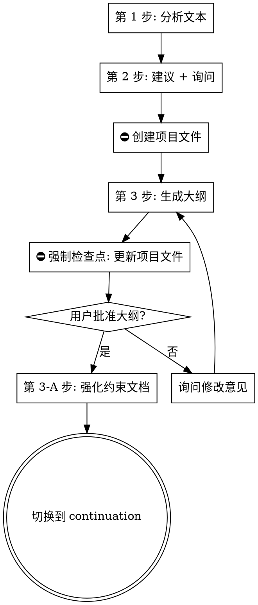

# 大纲生成技能（第 1-3-A 步）

## 概述

负责分析已拆分的小说文本、给出续写建议、生成大纲、强化约束文档。是 chapter-splitting 与 continuation 之间的桥梁。

**职责范围：** 第 1 步（分析）+ 第 2 步（建议+询问）+ 第 3 步（生成大纲）+ 第 3-A 步（强化约束）。

**通用红旗与全局交互点清单见 `novel-continuation/SKILL.md`。**

## 何时使用

- 章节文件已拆分（`chapters/*.md` 存在）
- 用户说"分析小说"、"生成大纲"、"规划续写"
- `meta/_project-meta.json.currentStep == "import-done"` 之后
- `meta/02-写作计划.json.status == "in_progress"` 或 `"pending"`

**不要用于：**
- 文件未拆分（应先调用 chapter-splitting）
- 大纲已生成，需要开始写作（应使用 continuation 技能）
- 文风分析（已在 chapter-splitting 0-A 步骤4 完成）

## 核心工作流



> 📌 **关键决策点修复：** 旧版本"大纲批准？→ 否"会回到"生成大纲"形成死循环。新版本**不批准时先询问修改意见**，然后**带着修改意见重新生成**（一次性重新生成，而非无限循环）。如果 2 轮仍不通过，标记 `currentStep: "outline-failed"` 并停止。

## 写前确认

按 `novel-continuation/SKILL.md` 的"写前确认通用模板"检查：
- [ ] `chapters/*.md` 存在
- [ ] `meta/_project-meta.json.currentStep` ∈ {`import-done`, `answers-ready`, `outline-ready`}
- [ ] 5 个 `design/*.md` 或仅部分存在（视当前进度）
- [ ] `config.genre` 已设置（来自 chapter-splitting 0-A 步骤3）

## 恢复点表

| 字段/文件 | 推断进度 | 恢复动作 |
|---------|---------|---------|
| `_project-meta.json.answers` 缺失 | 第 1-2 步 | 重做分析 + 询问 |
| `answers` 存在但 `design/01-大纲.md` 缺失 | 第 2 步完成 | 跳到第 3 步（生成大纲）|
| `01-大纲.md` 存在但 `chapters` 数组为空 | 第 3 步未填计划 | 填章节列表 |
| `01-大纲.md` 存在且 `chapters` 非空 | 第 3 步完成 | 跳到第 3-A 步（强化约束）|
| 6 个 `design/*.md` 齐全且 `currentStep == "constraint-docs"` | 第 3-A 步完成 | 退出至 continuation 技能 |
| 6 个 `design/*.md` 齐全但 `currentStep != "constraint-docs"` | 异常：chapter-splitting 已生成约束文档 | 补充 `currentStep` 并退出至 continuation |

**全局恢复（跨子技能）见 `novel-continuation/SKILL.md` 的"全局恢复决策树"。**

---

## 第 1 步：分析文本

### 🛑 写前确认（进入第1步前必须执行）

**对照流程图确认节点：** `第 1 步: 分析文本`

**前置条件检查：**
- [ ] `meta/_project-meta.json` 存在（如已执行0-A导入则必须有此文件）
- [ ] `meta/02-写作计划.json` 存在
- [ ] 章节文件已就绪（`chapters/` 目录存在且包含拆分文件）
- [ ] `config.genre` 已设置

**读取小说内容进行分析。必须从拆分后的章节文件（`chapters/第XX章-标题.md`，使用 UTF-8 编码读取）和已生成的约束文档中读取。如果尚未拆分，必须先回到 0-A 步骤1完成拆分，再读取。不允许直接读取未拆分的原始文本——分析阶段只接受已拆分文件作为输入。**

**写入运行日志：** 追加 `{"event": "outline_step_start", "step": 1, "timestamp": "..."}`

提取：

### 人物分析：
- 列出所有角色及其特质、动机、关系
- 识别人物弧线和发展阶段
- 注意任何未解决的人物冲突

### 情节分析：
- 总结当前情节点
- 识别主要冲突和支线情节
- 注意伏笔和未解决的线索
- 根据已建立的 Pattern 预测可能方向

### 结构分析：
- 识别叙事结构（章节、弧线、节奏）
- 注意写作风格和语调
- 识别视角和时态

### 文风分析：
- 验证 chapter-splitting 0-A 步骤4 生成的 `design/02-风格指南.md` 是否需要调整
- 如有参考文本，对比并修订
- 如无参考文本，从原文提取基础文风特征

### 世界设定分析：
- 提取已建立的世界观规则（魔法/科技体系、物理规则、社会结构）
- 识别地理分布和势力关系
- 注意设定中的边界和限制（如力量天花板）

### 专有名词提取：
- 列出所有专有名词（人名/地名/功法/物品/组织）
- 确保拼写和表述一致
- 标注每个名词首次出现的上下文

### 时间线梳理：
- 按章节整理已发生事件的时间顺序
- 标注时间跳跃和跨度
- 识别时间线中的空白期和矛盾点

### 章节意图规划：
- 根据分析结果，规划续写章节的意图
- 确定每章需要推进的核心事件
- 识别需要回收的伏笔
- 规划章节间的悬念钩子链路

**输出格式：**
```markdown
## 分析

### 人物
- [角色名]: [特质、动机、关系]

### 结构
- [风格、视角、节奏]

### 剧情预测
- [可能的方向]

### 文风特征
- [句子长度、词汇、对话风格]

### 世界设定
- [核心规则、地理势力、力量体系边界]

### 专有名词
- [术语拼写、首次出现上下文]

### 时间线概要
- [章节时间标记、总跨度、矛盾点]

### 续写规划
- [章节意图、核心事件、伏笔回收、悬念链路]
```

---

## 第 2 步：建议 + 询问 2 个问题

### 🛑 写前确认（进入第2步前必须执行）

**对照流程图确认节点：** `第 2 步: 建议 + 询问`

**前置条件检查：**
- [ ] 第 1 步（分析文本）已完成
- [ ] 已获得分析结果
- [ ] `config.genre` 已设置

### 2-A：给出建议续写章节数（提问前必须执行）

**在询问用户之前，必须根据分析结果给出具体的续写建议，包括建议的章节数和详细理由，帮助用户做出决策。**

建议依据（综合分析以下因素后给出推荐值）：
- **现有章节总数**：小说总章节数，判断整体规模
- **当前情节位置**：故事处于哪个阶段（高潮/转折/收尾/新篇章开头）
- **未收束的伏笔数量**：有多少待回收的线索，估算最少需要多少章
- **停更处的状态**：是章节中断（需衔接）、弧线完成（可开新篇章）、还是全书完本（需全新展开）
- **梦境/现实结构**：续写是否需要同时推进梦境和现实两条线
- **用户预期**：从上下文中推断用户想要的续写规模

**输出格式：**
```markdown
## 续写建议

### 建议章节数：[X] 章

### 理由
- [理由1: 基于现有章节总数和故事阶段]
- [理由2: 基于当前情节位置和待收束伏笔]
- [理由3: 基于停更处的状态和续写方向]

### 可选方案
- **最少 [X] 章**：[什么情况适合这个方案]
- **推荐 [X] 章**：[什么情况适合这个方案]
- **长篇 [X] 章**：[什么情况适合这个方案]
```

### 2-B：询问 2 个问题（全局交互点 #2）

给出建议后，只询问：

1. 续写多少章？
2. 是否增加人物？

**等待用户回答。不要询问其他问题。**（详见入口 SKILL.md 的"全局交互点清单"）

**写入运行日志：** 追加 `{"event": "questions_asked", "questions": ["chapterCount", "addCharacters"], "timestamp": "..."}`

## ⛔ 创建项目文件（中断恢复的基石）

**用户回答后，必须在此处停止并创建以下文件。创建完成前不得进入第3步。这是中断恢复的基石，不可跳过。**

**步骤：**
1. **创建/更新 `meta/_project-meta.json`** - 写入完整项目元数据：
   ```json
   {
     "novelName": "[小说名称]",
     "currentStep": "answers-ready",
     "status": "in_progress",
     "createdAt": "[创建时间]",
     "updatedAt": "[更新时间]",
     "answers": {
       "chapterCount": [用户回答的章数],
       "addCharacters": [true/false],
       "characterDescriptions": "[用户对新增人物的描述，如无则为空]"
     },
     "analysisSummary": "[第1步分析结果的简要摘要]",
     "config": { /* 来自 chapter-splitting 0-A，genre 已设 */ },
     "filesCreated": [
       "meta/_project-meta.json"
     ]
   }
   ```
2. **创建 `meta/02-写作计划.json`**（空骨架，第3步填充章节列表）：
   ```json
   {
     "title": "[小说名称]",
     "status": "in_progress",
     "chapters": [],
     "createdAt": "[创建时间]",
     "updatedAt": "[更新时间]"
   }
   ```
3. **确认两个文件已成功写入文件系统**
4. **记录文件路径到 `filesCreated` 字段**
5. **只有确认文件存在后，才能进入第3步**

**写入运行日志：** 追加 `{"event": "project_files_created", "files": [...], "timestamp": "..."}`

---

## 第 3 步：生成大纲

### 🛑 写前确认（进入第3步前必须执行）

**对照流程图确认节点：** `第 3 步: 生成大纲`

**前置条件检查：**
- [ ] 第 2 步已完成（用户已回答 2 个问题）
- [ ] `meta/_project-meta.json` 存在且 `answers` 字段已填写
- [ ] `meta/02-写作计划.json` 存在
- [ ] `config.genre` 已设置

根据分析 + 用户回答，生成大纲并更新项目文件。

**🔴 大纲必须按章节拆分为独立文件，写入 `outline/` 目录。每个章节对应一个独立的大纲文件，后续续写前逐一回顾。**

**每章大纲文件模板（写入 `outline/第{XX}章-{标题}.md`）：**
```markdown
# 第{XX}章: [标题]

## 核心事件
- [核心事件1]
- [核心事件2]

## 人物
- [出场人物及其在本章的发展]

## 场景列表
- [场景1]: [描述]
- [场景2]: [描述]

## 悬念钩子（章末）
- [钩子内容]

## 章节意图
- [该章在整体叙事中的作用，伏笔回收/推进主线/深化人物等]
```

**同时更新 `design/01-大纲.md`（master 大纲索引），保持全局概览视图：**
```markdown
## 大纲

### 第X章: [标题]
- 剧情: [情节点]
- 人物: [人物发展]
- 悬念钩子: [结尾钩子]
- 章节意图: [核心事件、伏笔回收]
```

### ⛔ 强制检查点：更新项目文件（大纲生成后、询问批准前必须执行）

**大纲生成后、询问用户批准前，必须先更新以下文件。更新完成前不得询问批准。**

**步骤：**
1. **创建/更新 `design/01-大纲.md`** - master 大纲索引（全局概览）
2. **创建每个章节的独立大纲文件到 `outline/` 目录** - `outline/第{XX}章-{标题}.md`（每章详细规划）
3. **更新 `meta/02-写作计划.json`** - 填入章节列表：
   ```json
   {
     "chapters": [
       {
         "title": "第X章-标题",
         "status": "pending",
         "filePath": "chapters/第X章-标题.md",
         "targetWordCount": "config.minWordCount",
         "revisionHistory": []
       }
     ]
   }
   ```
   每章的 `status: "pending"`（**注意不是 `completed`**，completed 只用于"已通过评审"）
4. **更新 `meta/_project-meta.json`** - 设 `currentStep: "outline-ready"`，将 `design/01-大纲.md` 和 `outline/` 目录下的所有大纲文件加入 `filesCreated`，更新 `updatedAt`
5. **确认 `design/01-大纲.md`、`outline/` 下所有大纲文件、`meta/02-写作计划.json`、`meta/_project-meta.json` 均已成功写入**

**写入运行日志：** 追加 `{"event": "outline_generated", "chapters": N, "outline_files": ["outline/第01章-标题.md", ...], "timestamp": "..."}`

**询问用户批准（全局交互点 #3）。还没有开始写作。**

---

## 第 3-A 步：强化约束文档

### 🛑 写前确认（进入第3-A步前必须执行）

**对照流程图确认节点：** `第 3-A 步: 强化约束文档`

**前置条件检查：**
- [ ] 第 3 步已完成（大纲已生成且用户已批准）
- [ ] `design/01-大纲.md` 存在
- [ ] `meta/02-写作计划.json` 的章节列表已填入
- [ ] `meta/_project-meta.json` 的 `currentStep` 为 `"outline-ready"`

**如0-A已执行过约束文档生成，第3-A步是强化而非重建：**
- 读取已有约束文档
- 补充大纲中规划的新章节所需的新设定/新角色
- 补充大纲中规划的新人物条目到 `design/00-人物档案.md`
- 补充续写章节涉及的专有名词到 `design/05-术语表.md`

**🔴 大纲批准后、开始写作前，必须先完成所有约束文档的生成。未完成约束文档不得进入第4步。**

**进入第3-A步时：**
- 更新 `meta/_project-meta.json`，设 `currentStep: "constraint-docs"`，更新 `updatedAt`
- 写入运行日志：`{"event": "strengthen_constraints_start", "timestamp": "..."}`

**必选约束文档（不可跳过，所有文件保存到 `design/` 目录）：**
- [ ] `design/00-人物档案.md` — 完整人物档案，含弧线规划和关系网
- [ ] `design/03-世界设定书.md` — 世界观规则和设定
- [ ] `design/04-时间线.md` — 事件时间线
- [ ] `design/05-术语表.md` — 专有名词表
- [ ] `design/06-核心驱动.md` — 主线/支线/伏笔追踪

**按 `config.genre` 激活的附加文档：**
- [ ] `design/02-风格指南.md`（仅当 `config.genre != "general"` 且用户提供过参考文风）
- [ ] `truth/数值系统.json`（仅 `xianxia` / `xuanhuan` / `litrpg` / `mori`）
- [ ] `truth/年代考据.json`（仅 `dushi` / `lishi`）

**约束文档分类总览见 `novel-continuation/SKILL.md` 的"约束文档分类"。**

**所有文件创建完成后：**
1. **更新 `meta/_project-meta.json`** - 将所有新建/强化的文件名（含子目录前缀）追加到 `filesCreated`，更新 `updatedAt`
2. **写入运行日志：** `{"event": "constraints_strengthened", "files": [...], "timestamp": "..."}`
3. **标记约束文档就绪，进入第4步逐章写作（切换到 continuation 技能）。**

### 3-A.1 强化 `design/00-人物档案.md`

在分析阶段的人物分析基础上，扩展为完整格式：
```markdown
## [角色名]
- 身份/定位: [主角/反派/配角/辅助]
- 性格核心: [3个关键词，概括性格本质]
- 致命缺陷: [阻碍其成长或导致其失败的性格弱点]
- 人物弧线: [初始状态 → 目标状态 → 当前进展阶段]
- 说话风格: [口头禅、语气特点、句式偏好]
- 深层恐惧: [驱动其行为的内在恐惧]
- 核心动机: [驱动其行动的最深层欲望]
- 关系网: [与其他角色关系及变化趋势（如"第3章后关系恶化"）]
- 战力/能力等级: [适用题材时填写，标注当前境界/等级]
```

**生成规则：**
- 大纲中规划的新人物必须添加完整条目
- 已有角色补充弧线规划，标注当前进展到哪一阶段
- 关系网中标注变化趋势和关键转折事件

### 3-A.2 创建 `design/03-世界设定书.md`

```markdown
# 世界设定书

## 世界观核心规则
- [规则1: 描述，如"魔法需要等价交换"]
- [规则2: 描述]

## 地理与势力分布
- [地点/势力名]: [描述、重要性、势力关系]

## 力量体系（如适用）
- [体系名称]: [等级划分、规则限制、特殊机制]
- [等级1] → [等级2] → [等级3]: [突破条件]

## 政治格局
- [势力关系、联盟、冲突焦点]

## 历史背景
- [事件/时期]: [描述、对当前剧情的影响]

## 特殊设定
- [魔法/科技/文化/经济等专项设定]
```

**生成规则：**
- 从已分析文本中提取已建立的世界观规则，确保不遗漏
- 从大纲中提取新章节涉及的新设定，标注"新设定"
- 玄幻/仙侠题材必须详细定义力量体系（等级名称、突破条件、能力边界）
- 都市题材重点提取社会规则和年代背景

### 3-A.3 创建 `design/04-时间线.md`

```markdown
# 时间线

## 已有章节事件
| 章节 | 时间标记 | 关键事件 | 备注 |
|------|---------|---------|------|
| 第X章 | [具体时间/模糊时间] | [事件摘要] | [注意] |

## 计划章节时间分配
| 章节 | 预期时间 | 规划事件 |
|------|---------|---------|
| 第X章 | [时间点] | [核心事件] |

## 跨章时间跨度
- 第1章-当前: [时间跨度]
- 续写章节预估: [预估时间跨度]
- 全局总跨度: [总时间跨度]
```

**生成规则：**
- 从已有文本中提取每个章节的时间标记（"三日后"、"一周前"等）
- 标注模糊时间与精确时间的对应关系
- 根据大纲规划未来章节的时间分配，避免时间跳跃矛盾
- 每完成一章立即追加事件记录

### 3-A.4 创建 `design/05-术语表.md`

```markdown
# 术语表

## 人物
| 姓名 | 身份/定位 | 别称/绰号 | 首次出现 |
|------|----------|----------|---------|
| [姓名] | [身份] | [别称] | 第X章 |

## 地点
| 地名 | 归属/势力 | 描述 | 首次出现 |
|------|----------|------|---------|
| [名] | [势力] | [简要描述] | 第X章 |

## 功法/技能/物品
| 名称 | 类型 | 描述/效果 | 等级/品阶 | 持有者 | 首次出现 |
|------|------|----------|----------|-------|---------|
| [名] | [功法/技能/物品] | [描述] | [等级] | [持有者] | 第X章 |

## 组织/势力
| 名称 | 性质 | 核心成员 | 目标 | 首次出现 |
|------|------|---------|------|---------|
| [名] | [门派/家族/国家] | [成员] | [目标] | 第X章 |

## 其他专有名词
| 名词 | 定义 | 备注 |
|------|------|------|
| [名] | [定义] | [备注] |
```

**生成规则：**
- 提取文中所有专有名词，确保拼写一致（尤其音译名）
- 仙侠/玄幻题材重点提取功法名称、境界名称、法宝名称及其效果
- 续写中出现新名词必须在当章收尾时立即追加
- 冲突术语（同名不同指）必须标注区分

### 3-A.5 创建 `design/06-核心驱动.md`

```markdown
# 核心驱动

## 核心主题
[一句话概括故事的中心主题或核心信息]

## 中心问题（驱动读者阅读的核心悬念）
[读者最想知道答案的核心问题]

## 主线推进状态
| 主线目标/事件 | 状态 | 最近进展 | 预期完成章节 |
|-------------|------|---------|-------------|
| [目标] | [未开始/进行中/已完成] | 第X章 | 第X章 |

## 支线状态
| 支线名称 | 状态 | 最近推进 | 下次推进预期 | 搁置风险 |
|---------|------|---------|-------------|---------|
| [支线] | [进行中/停滞/已收束] | 第X章 | 第X章 | [低/中/高] |

## 读者期待债务
| 承诺/伏笔 | 预期回收章节 | 当前状态 | 优先级 |
|-----------|-------------|---------|-------|
| [内容] | 第X章 | [未回收/已回收] | [高/中/低] |
```

**生成规则：**
- 从分析中提炼核心主题，一句话说清故事本质
- 中心问题是"读者为什么想看下一章"的终极答案
- 主线事件从大纲提取，续写中逐步标记完成
- 支线状态必须每章更新，搁置超过5章标记"高"风险
- 读者期待债务来自大纲中的伏笔和章节钩子，追踪每个承诺的兑现

---

## 本阶段特有红旗

通用红旗见入口 SKILL.md。**以下为本阶段特有：**

- **询问 > 2 个问题** → 只询问指定的 2 个问题（全局交互点 #2）
- **大纲批准不通过时无限循环** → 2 轮后强制标记 `outline-failed`，停止（详见流程图修复说明）
- **在大纲生成后暂停** → 等待批准后，写完 ALL
- **跳过第 3-A 步约束文档强化** → 大纲批准后必须先完成约束文档强化再退出
- **AI 主观判断题材与激活约束** → 严格按 `config.genre` 激活
- **未等用户回答就开始写大纲** → 必须等待"全局交互点 #2"用户回答
- **文风分析归 outline** → 已归到 chapter-splitting 0-A 步骤4，本技能不重复

## 异常决策树（本章特有）

通用异常决策树见 `novel-continuation/SKILL.md` 末尾。**本章特有补充：**

| 异常 | 决策 |
|------|------|
| 用户对第 2 步 2 个问题的回答自相矛盾（如"续写 5 章，不要加人物，但加一个反派"） | 按字面回答处理，但在决策日志记录矛盾 |
| 大纲生成后用户长时间不批准（>24h） | 保留 `currentStep: "outline-ready"`，允许从该状态恢复 |
| 大纲 2 轮仍未通过 | 设 `currentStep: "outline-failed"`，停止工作流，由用户手动决定 |
| 约束文档强化时发现 0-A 阶段遗漏 | 立即补全，在决策日志追加"补全记录" |
| `config.genre` 缺失 | 回到 chapter-splitting 0-A 步骤3 重新识别 |
